# Build the Docker image for the operator and push to Oracle Cloud Infrastructure Registry (OCIR) #

This tutorial is based on the official [Oracle WebLogic Kubernetes Operator](https://github.com/oracle/weblogic-kubernetes-operator/blob/master/site/installation.md) installation guide.

To run the operator in a Kubernetes cluster, you need to build the Docker image and then deploy it to your cluster. The operator sources can be found on github.com and is built using Apache Maven. In this tutorial you can find two ways to build WebLogic Kubernetes Operator and upload to Container Registry (OCIR) for later deployment:

1. Using Oracle Pipelines (Wercker) which requires only an internet browser.
2. Using Docker/Apache Maven/Java/Git installed workstation.

### Common prerequisite for both scenarios ###

#### Accept Licence Agreement to use `store/oracle/serverjre:8` image from Docker Store ####

If you have not used the base image [`store/oracle/serverjre:8`](https://store.docker.com/images/oracle-serverjre-8) before, you will need to visit the [Docker Store web interface](https://store.docker.com/images/oracle-serverjre-8) and accept the license agreement before the Docker Store will give you permission to pull that image.

Open [https://store.docker.com/images/oracle-serverjre-8](https://store.docker.com/images/oracle-serverjre-8) in a new browser and click **Log In**.

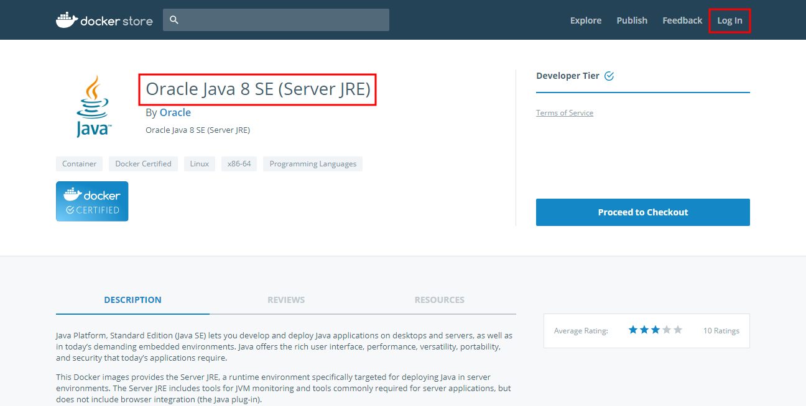

Enter your account details and click **Login**.

Click **Proceed to Checkout**.

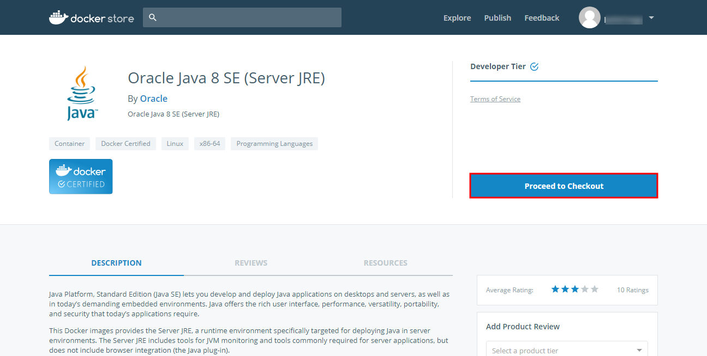

Complete your contact information and accept agreements. Click **Get Content**.

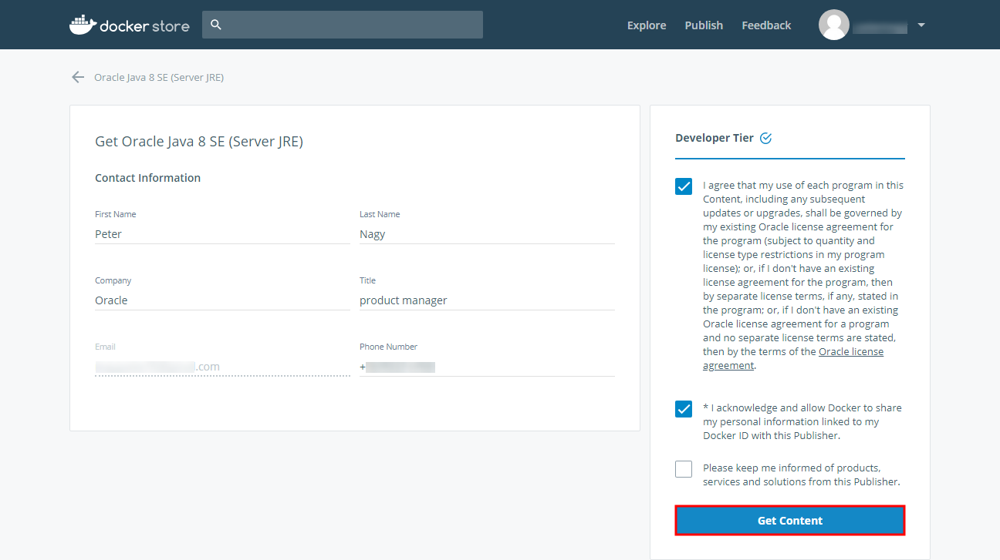

Now you are ready to pull the  image on docker enabled host after authenticating yourself in Docker Hub using your Docker Hub credentials.

#### Get Authentication Token to use Oracle Cloud Infrastructure Registry (OCIR) ####

Oracle Cloud Infrastructure Registry is an Oracle-managed registry that enables you to simplify your development to production workflow. You can use Oracle Cloud Infrastructure Registry as a public or private Docker registry, pushing and pulling Docker images to and from the Registry using the Docker V2 API and the standard Docker command line interface (CLI).

Using the Console, create an empty repository in Oracle Cloud Infrastructure Registry and give it a name. Any images you subsequently push to the registry that include the repository in the image name are grouped into that repository. Creating an empty repository can be a convenient placeholder, but it is not strictly necessary. If you push an image that includes a repository in the image name and the repository doesn't already exist (for example, `iad.ocir.io/acme-dev/project02/acme-web-app:7.5.2`), a new repository is created automatically. And if you push an image that doesn't include a repository in the image name (for example, `iad.ocir.io/acme-dev/acme-web-app:7.5.2`), the image's name (`acme-web-app`) is used as the name of the repository.

Oracle Cloud Infrastructure Registry (OCIR) has native support for Docker Registry v2 token authentication. Before you can push and pull Docker images to and from Oracle Cloud Infrastructure Registry, you must already have an Oracle Cloud Infrastructure username and an auth token. In the next step you will generate your token.

Open the Oracle Cloud Infrastructure (OCI) console. If necessary first [sign in](https://cloud.oracle.com/en_US/sign-in) to your cloud account. Once you logged in click your name on top-rigth corner and select **User Settings**. On the user details page select **Auth Tokens** in the left menu. Click **Generate Token**.

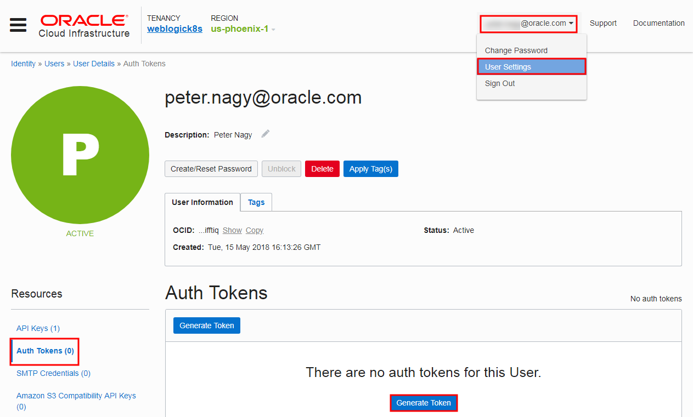

Enter a friendly description for the auth token and click **Generate Token**.

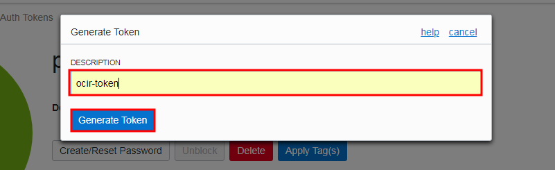

The new auth token is displayed. **Copy** the auth token immediately to a secure location from where you can retrieve it later, because you won't see the auth token again in the Console. **Close** the Generate Token dialog.

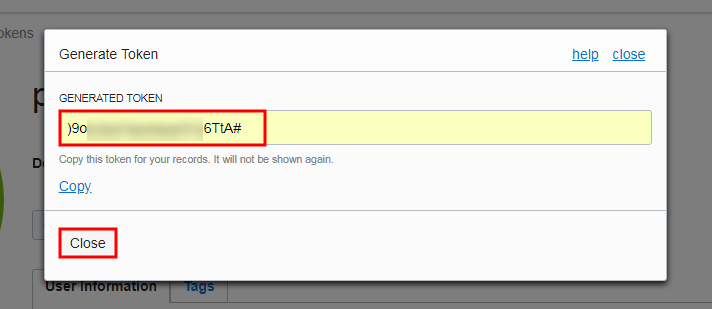

## 1. Build the Docker image for the operator using Oracle Pipelines (Wercker) ##

### Prerequisites ###

- [Oracle Cloud Infrastructure](https://cloud.oracle.com/en_US/cloud-infrastructure) enabled account.
- [Github](sign.up.github.md) account.
- [Oracle Container Pipelines (former Wercker)](sign.up.wercker.md) account.
- [Docker](sign.up.docker.md) account.

#### Fork the WebLogic Kubernetes Operator sources ####

Visit the official [Oracle WebLogic Kubernetes Operator](https://github.com/oracle/weblogic-kubernetes-operator) site and click **Fork** to get your copy. If you are not signed in then first you need to log in to github using your account.

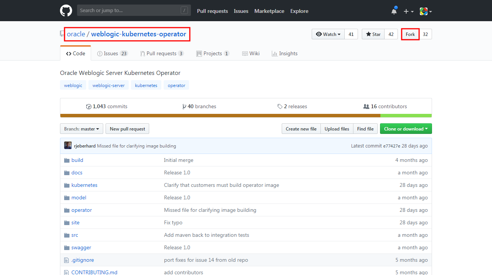

When the fork is done you can see your new WebLogic Kubernetes Operator forked repository under your Github account.

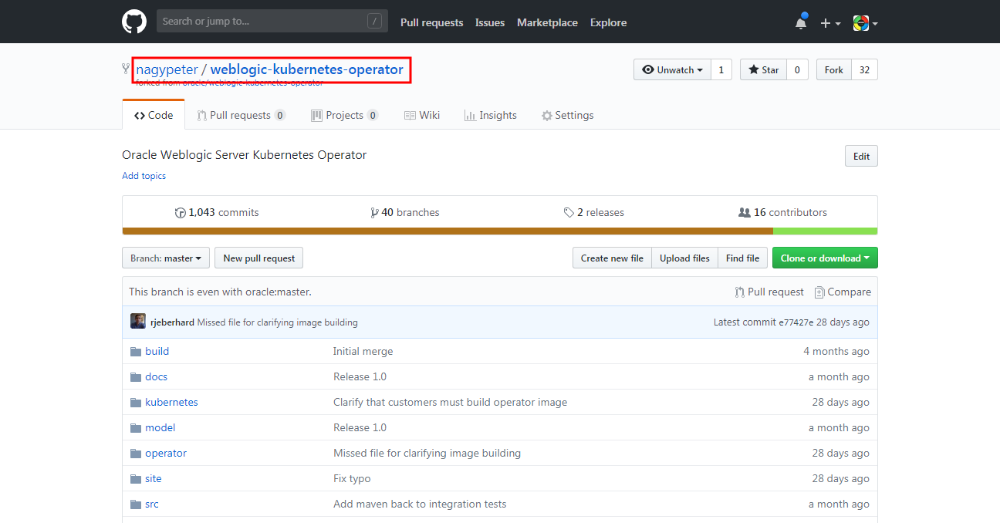

#### Create Oracle Pipelines Application to build the WebLogic Kubernetes Operator ####

If you dont't have Oracle Pipelines (Wercker) account then [sign up](sign.up.wercker.md) before you move forward.

Having the account open a browser or tab and navigate to [https://app.wercker.com]() and create a new application. Click **Create your first application** if you have fresh new account or find the plus sign on the top left corner and click. Select **Add application**.

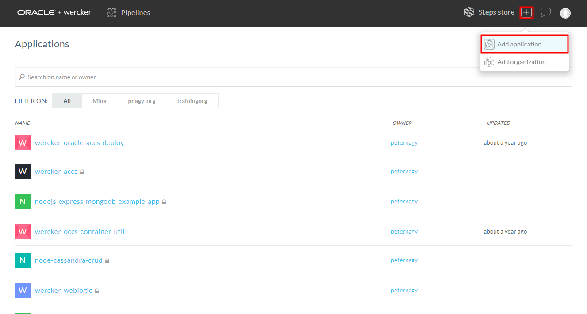

Select the owner of the application. By default it is your Oracle Pipelines username, but it can be any organization where you belong to. Make sure the selected SCM is *GitHub*. Click **Next**.

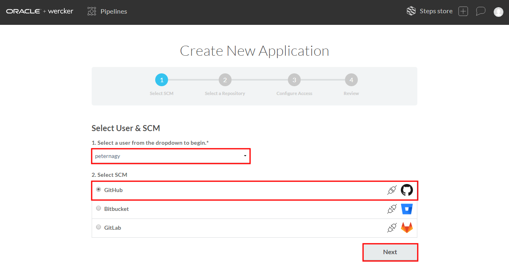

Select *WebLogic Kubernetes Operator* repository what you forked previously. Click **Next**.

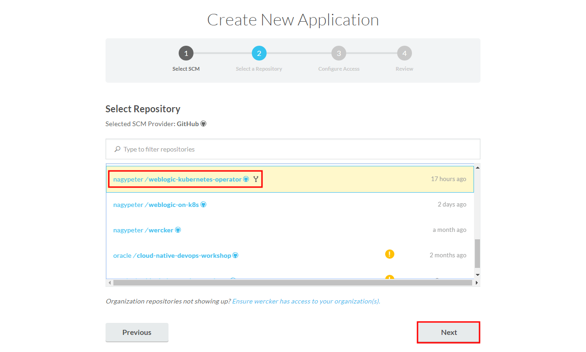

Leave the default repository access without SSH key. Click **Next**.

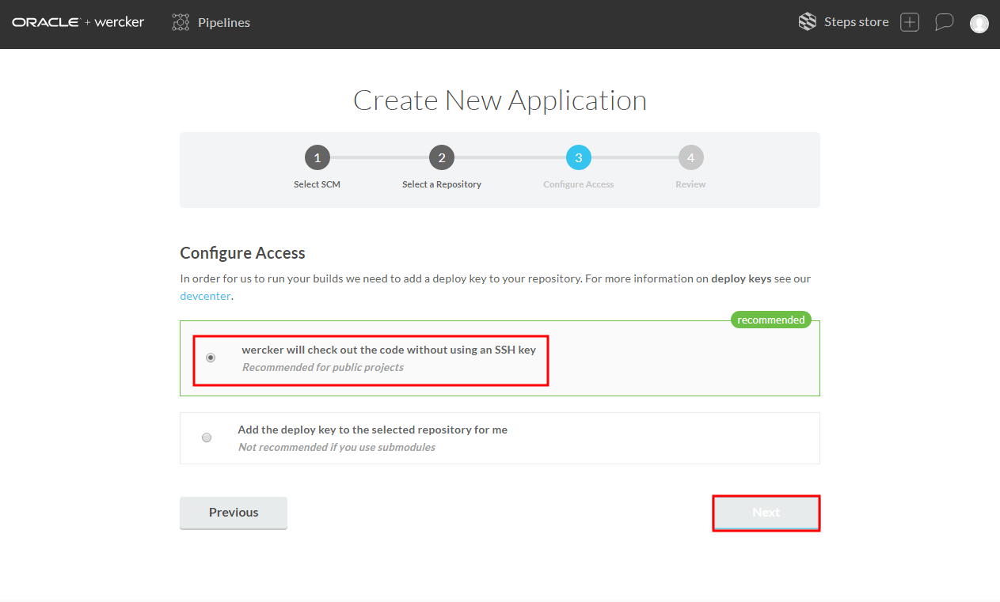

If you want you can make your application public if you want to share the application's status otherwise leave the default private settings. Click **Create**.

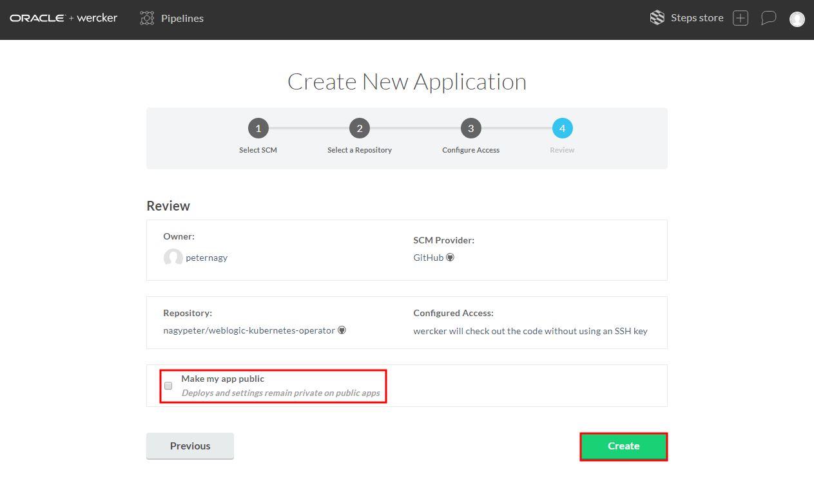

The repository already contains a necessary `wercker.yml` but before the execution provide the following key/value pairs:

| Key | Value | OCIR Sample |
| --- | --- | --- |
| `DOCKER_USERNAME` | Username for the Docker store for pulling server JRE image | <YOUR_DOCKER_USERNAME> |
| `DOCKER_PASSWORD` | Password for the Docker store | <YOUR_DOCKER_PASSWORD> |
| `REPO_REGISTRY`| Registry address | `https://phx.ocir.io/v2`  |
| `REPO_REPOSITORY` | Repository value | `phx.ocir.io/<YOUR_TENANCY>/weblogic-kubernetes-operator` |
| `REPO_USERNAME` | Username for registry | `<YOUR_TENANCY>/<YOUR_USERNAME>` |
| `REPO_PASSWORD` | Password for registry | `Use generated Auth Token password` |
| `IMAGE_TAG_OPERATOR` | Image tag, such as `version1.0` or `latest` |  |

To define these variables click **<>Environment** tab and enter keys and values. Remember that these values will be visible to anyone to whom you give access to the Wercker application, therefore, select **Protected** for any values that should remain hidden, including all passwords.

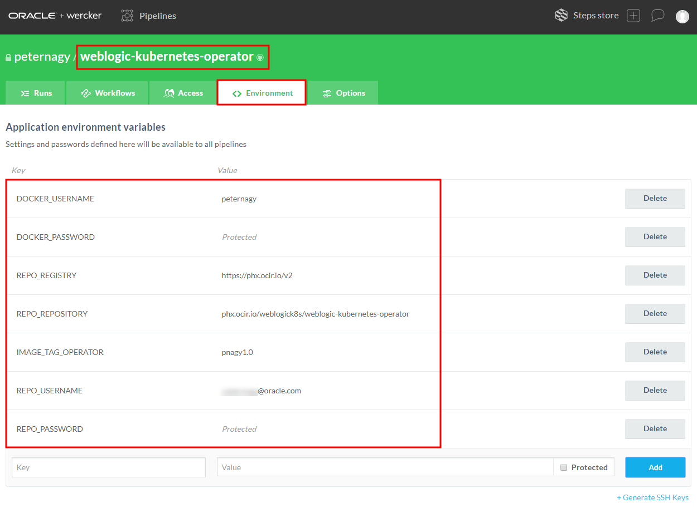

Select the **Runs** tab. Scroll to the bottom and click **Trigger your first build now**.

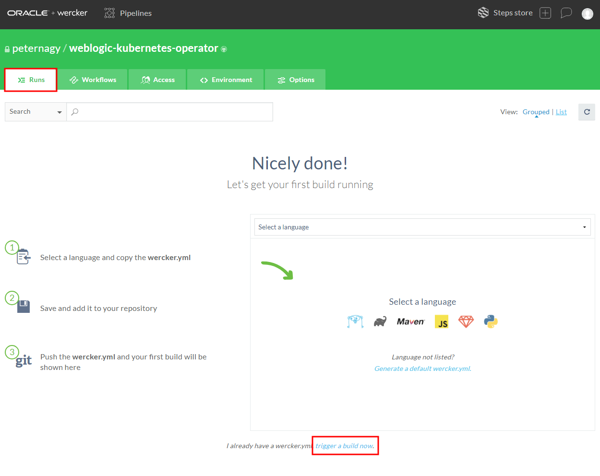

When the run completes successfully, the Docker image for the operator will be built and published to your OCIR repository.

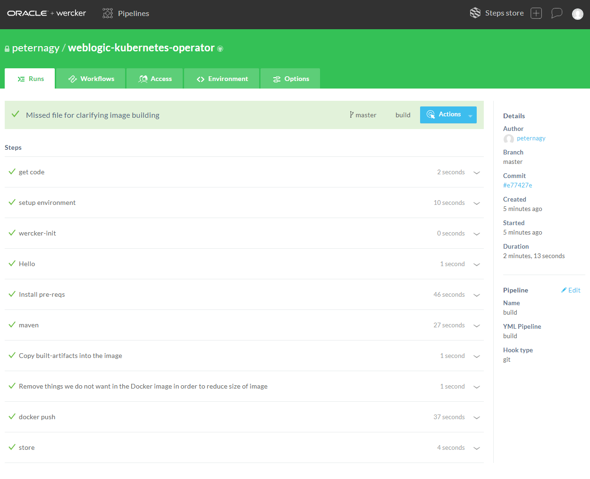

Check the WebLogic Kubernetes Operator image in your repository. Open the OCI console click the menu icon  on the top-left corner and select **Registry** in the *Containers* section.

Select the `weblogic-kubernetes-operator` repository and click the *tag* what you defined for your image.

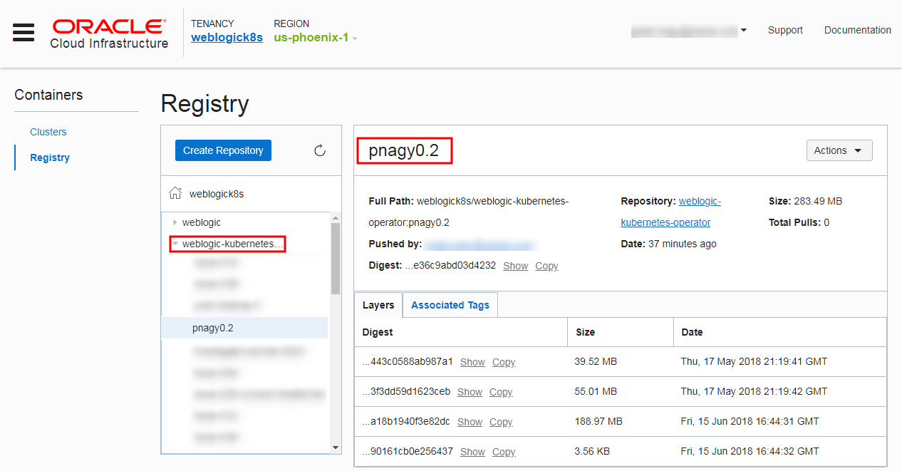

## 2. Build the Docker image for the operator locally ##

### Prerequisites ###

The following software is required on your workstation to build the operator:

- Git (1.8 or later recommended)
- Apache Maven (3.3 or later recommended)
- Java Developer Kit (1.8u131 or later recommended, not 1.9)
- Docker 17.03.1.ce	

#### Clone the WebLogic Kubernetes Operator GitHub repository ####

The WebLogic Kubernetes Operator repository on GitHub should be cloned locally:

	git clone https://github.com/oracle/weblogic-kubernetes-operator.git

Change the directory to the project root directory and execute the build:

	cd weblogic-kubernetes-operator
	mvn clean install

Log in to the Docker Store so that you will be able to pull the base `store/oracle/serverjre:8` image. 

	docker login

Create tag (name) of the image which reflects the full container repository (OCIR) path including the registry where you want to push the image. In case of OCI it is the following format: `<region-code>.ocir.io/<tenancy-name>/<repos-name>/<image-name>:<tag>`.

- **<region-code>** is one of **fra** (Frankfurt), **iad** (Ashburn), **lhr** (London), or **phx** (Phoenix).
- **ocir.io** is the Oracle Cloud Infrastructure Registry name.
- **<tenancy-name>** is the name of the tenancy that owns the repository to which you want to push - the image.
- **<repo-name>** (if specified) is the name of a repository to which you want to push the image. You don't need to specify this now.
- **<image-name>** is the name you want to give the image in Oracle Cloud Infrastructure Registry. In this case *weblogic-kubernetes-operator* is recommended.
- **<tag>** is an image tag you want to give the image in Oracle Cloud Infrastructure Registry. Use your username and a version number e.g. *pnagy0.2*.

Create the Docker image as follow but don't forget to construct your image name.

**docker build -t <region-code>.ocir.io/<tenancy-name>/<image-name>:<tag>**

For example:

	$ docker build -t phx.ocir.io/weblogick8s/weblogic-kubernetes-operator:pnagy0.3 --no-cache=true .

Log in to Oracle Cloud Infrastructure Registry (OCIR) by entering `docker login <region-code>.ocir.io`, where:

| Region Code | Region Name |
|-------------|-------------|
| fra         | Frankfurt   |
| iad         | Ashburn     |
| lhr         | London      |
| phx         | Phoenix     |

For example:

	$ docker login phx.ocir.io

When prompted, enter your username in the format `<tenancy_name>/<username>`. For example, **acme-dev/jdoe@acme.com**.

When password is prompted, enter the auth token you generated and copied earlier.

Push the Docker image from the client machine to Oracle Cloud Infrastructure Registry by entering:

	$ docker push phx.ocir.io/weblogick8s/weblogic-kubernetes-operator:pnagy0.2 
	The push refers to repository [phx.ocir.io/weblogick8s/weblogic-kubernetes-operator]
	25bc6ac3eb25: Pushed 
	454a9376e06f: Pushed 
	a4b8e5dba9d2: Pushed 
	40d0923dca41: Pushed 
	c0ca147fbb4a: Pushed 
	708ff5a33e5a: Pushed 
	8fa58df4d60d: Pushed 
	401b941ef605: Pushed 
	pnagy0.2: digest: sha256:9ffd10872e66371c98f2362db4f21efafe079472bf477344aef758e9d8436396 size: 1991

Check the WebLogic Kubernetes Operator image in your OCIR repository. Open the OCI console click the menu icon  on the top-left corner and select **Registry** in the *Containers* section.

Select the `weblogic-kubernetes-operator` repository and click the *tag* what you defined for your image.

