# Build and deploy demo application to WebLogic domain using Oracle Pipelines (Wercker) #

**Oracle Pipelines (Wercker)** is a Docker-Native CI/CD  Automation platform for Kubernetes & Microservice Deployments. Wercker is integrated with Docker containers, which package up application code and can be easily moved from server to server. Each build artifact can be a Docker container. The user can take the container from the Docker Hub or his private registry and build the code before shipping it. Its SaaS platform enables developers to test and deploy code often. They can push software updates incrementally as they are ready, rather than in bundled dumps. It makes it easier for coders to practice continuous integration, a software engineering practice in which each change a developer makes to the codebase is constantly tested in the process so that software doesn’t break when it goes live.

Oracle Pipelines is based on the concept of pipelines, which are automated workflows. Pipelines take pieces of code and automatically execute a series of steps upon that code.

This tutorial demonstrates how to create Oracle Pipelines application (CI/CD) to build and deploy sample application to WebLogic Domain through REST management interface.

The key components of Oracle Pipelines:

+ **Step** is self-contained bash script or compiled binary for accomplishing specific automation tasks.
+ **Pipelines** are a series of steps that are triggered on a git push or the completion of another pipeline.
+ **Workflows** are a set of chained and branched pipelines that allow you to form multi-stage, multi-branch complex CI/CD flows that take your project from code to production. 
+ All Wercker pipelines execute inside a **Docker container** and every build artefact can be a Docker container.

### Prerequisites ###

- [Oracle Cloud Infrastructure](https://cloud.oracle.com/en_US/cloud-infrastructure) enabled account.
- Running [Container Engine for Kubernetes (OKE)](setup.oke.md) cluster.
- [Oracle WebLogic Domain deployed](setup.weblogic.kubernetes.md) on [OKE cluster](setup.oke.md).
- Desktop with `Docker 17.03.1.ce` and `kubectl` installed. `kubectl` has to be [configured to access to the Kubernetes Cluster](setup.oke.md).

---

#### Import CreditScore sample application's source into your Github repository ####

Sign in to [https://github.com](https://github.com) using your account and select **Import repository**.

Enter or copy the *https://github.com/nagypeter/angular-java-creditscore.git* repository address into old repository's clone URL and choose a repository name e.g. creditscore-application for the new one. Leave the repository public. Click **Begin Import** and wait till the import is ready.

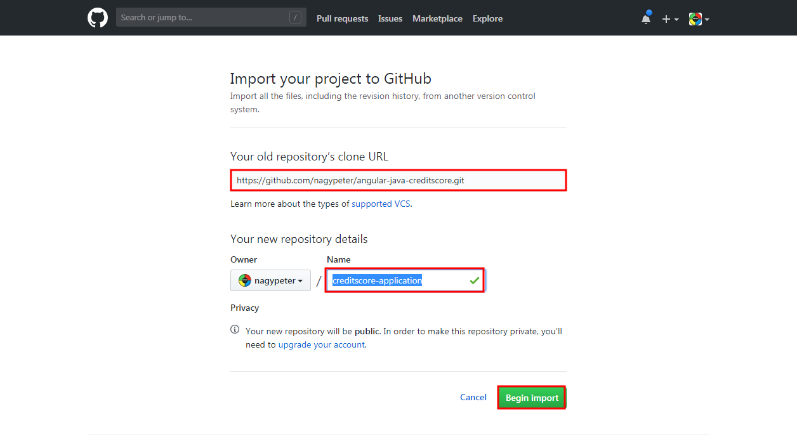

#### Create Wercker Application to build Docker container including Spring Boot sample application ####

First create your Oracle Pipelines application. Oracle Pipelines acts as continuous integration tool which will produce the build artifact and deploy your sample application to WebLogic Domain.

Sign in to Oracle Pipelines and click **Create your first application** button or the **+Create** dropdown list and select *Application*.

Select the owner of the application. By default it is your Oracle Pipelines username, but it can be any organization where you belong to. Make sure the selected SCM is *GitHub*. Click **Next**.

Select *creditscore-application* repository what you imported previously. Click **Next**.

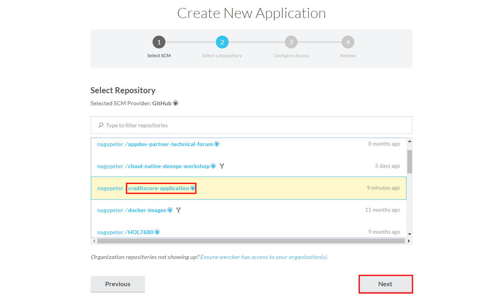

Leave the default repository access without SSH key. Click **Next**.

If you want you can make your application public if you want to share the application's status otherwise leave the default private settings. Click **Create**.

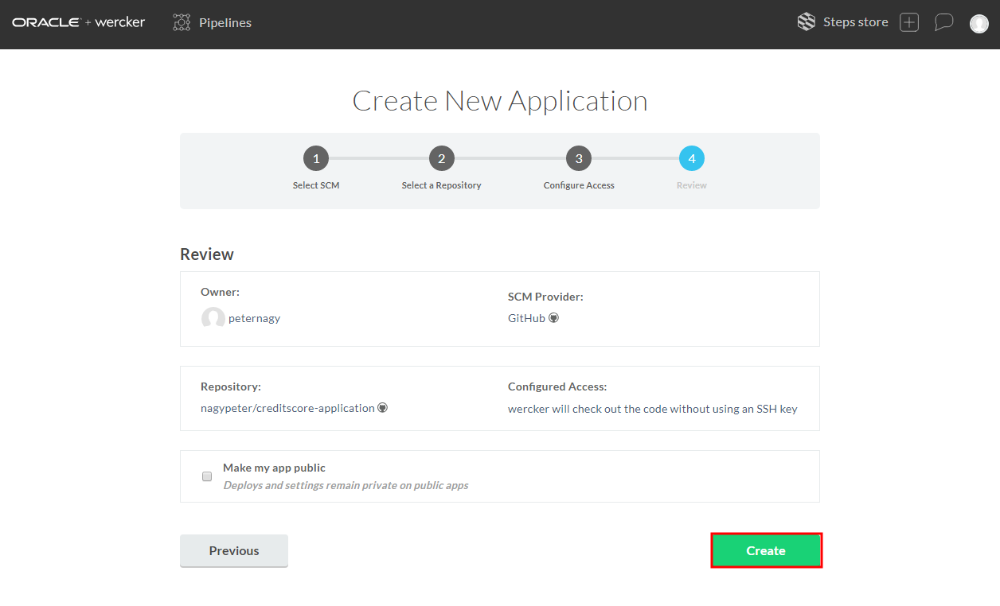

The repository already contains a necessary `wercker.yml` but before the execution provide the following key/value pairs:

| Key            | Value                                                                     | Note for WebLogic on OKE                                                                                                                                         |
|----------------|---------------------------------------------------------------------------|------------------------------------------------------------------------------------------------------------------------------------------------------------------|
| WLS_IP         | The Public IP address of the loadbalancer configured for WebLogic Domain. |  `kubectl get pod -n <domain_namespace> -o wide` Use any Node IP address.                                                     |
| WLS_ADMIN_PORT | The administration port of the WebLogic Admin server.                     | If you haven't modified the default it should be 30701. Or run `kubectl get service -n <domain_namespace> <domainUID>-admin-server` Find the port number after colon. |
| WLS_ADMIN      | WebLogic administrator's username.                                        |                                                                                                                                                                  |
| WLS_PASSWORD   | WebLogic administrator's password.                                        |                                                                                                                                                                  |

To get WLS_IP execute the following `kubectl` command:

	kubectl get pod -n <domain_namespace> -o wide

For example.

	kubectl get pod -n domain1 -o wide
	NAME                                         READY     STATUS    RESTARTS   AGE       IP            NODE
	domain1-admin-server                         1/1       Running   0          1d        10.244.4.32   129.146.166.187
	domain1-cluster-1-traefik-778bc994f7-vps9h   1/1       Running   0          12d       10.244.4.27   129.146.166.187
	domain1-managed-server1                      1/1       Running   0          12d       10.244.5.7    129.146.133.192

For example in the result above it can be any IP address starting with 129.146.x.x.

To determine the port number execute:

	kubectl get service -n <domain_namespace> <domainUID>-admin-server

For example.

	kubectl get service -n domain1 domain1-admin-server
	NAME                   TYPE       CLUSTER-IP    EXTERNAL-IP   PORT(S)          AGE
	domain1-admin-server   NodePort   10.96.219.0   <none>        7001:30701/TCP   12d

Then note the second port number after the colon. For example in the result above it is: 30701.

To define these variables click **<>Environment** tab and enter keys and values. Remember that these values will be visible to anyone to whom you give access to the Wercker application, therefore, select **Protected** for any values that should remain hidden, including all passwords.

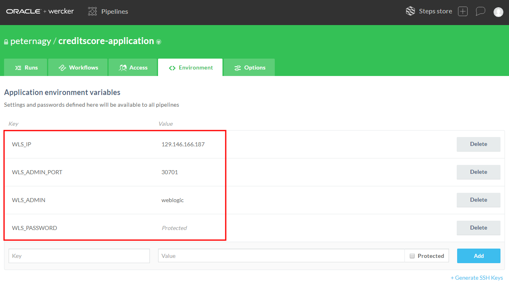

Click the **Worklflow** tab and then **Add new pipeline** to enable pipeline defined in *wercker.yml*.

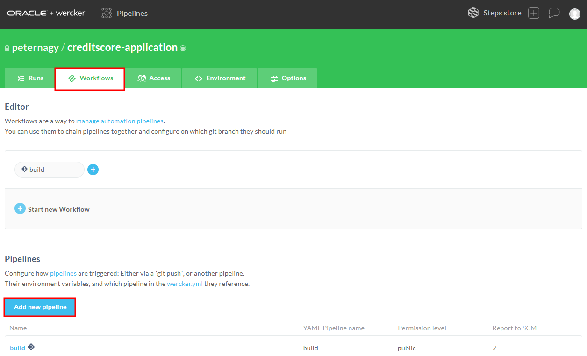

Enter the name of the pipeline for example *deploy-to-weblogic*. Enter the exactly same name of the pipeline definition can be found in the *wercker.yml*. It is *deploy-to-weblogic*. Click **Create**.

Click again the **Worklflow** tab to get back to the editor page. Click the + sign after the mandatory *build* pipeline. Leave the default branch(es) configuration and select the *deploy-to-weblogic* pipeline.

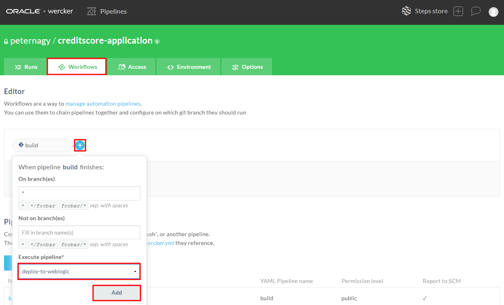

Your workflow should be similar:

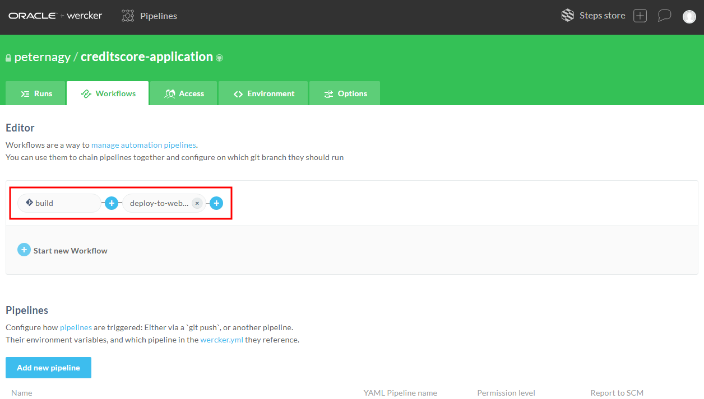

Go to the **Runs** tab and click ***trigger a build now*** link.

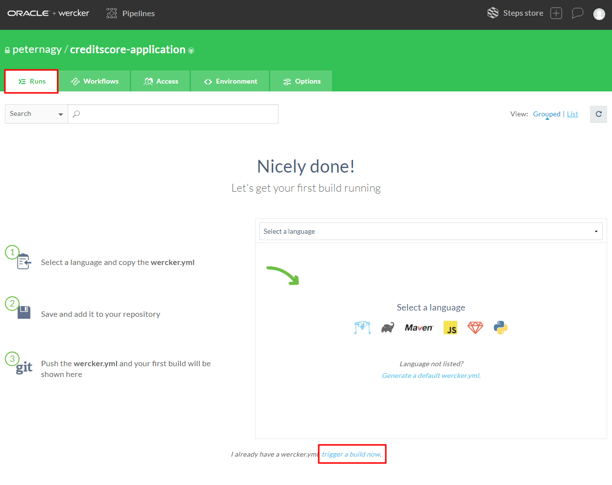

To get more details about the current step click on the pipeline.

During the pipeline execution you can see the currently running step. You can review the details of the completed steps by clicking on the name.

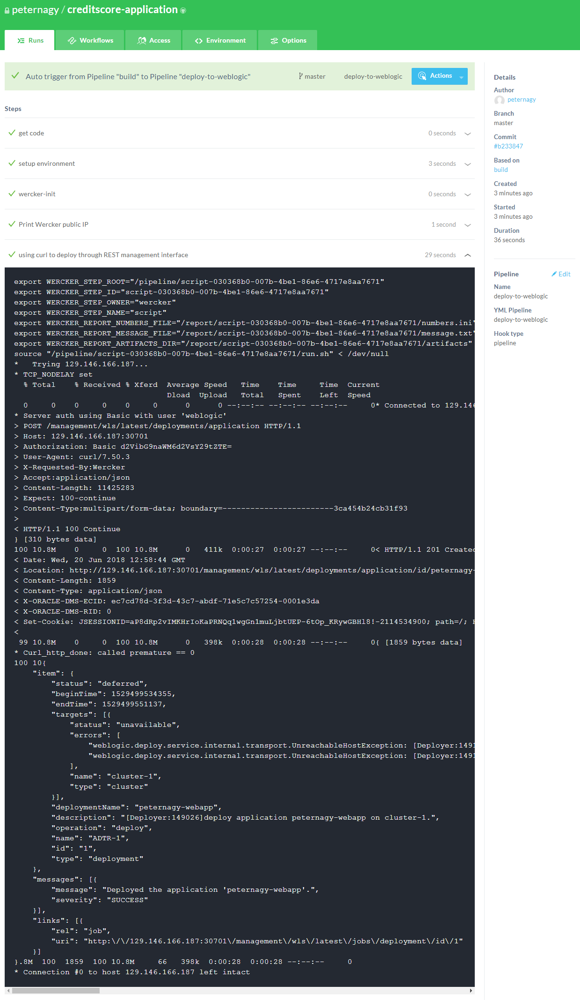

When the workflow is completed the application is available on your WebLogic domain. 

To open the application you can use any of the public IP address of the nodes. For example what you have defined for WLS_IP as environment variable in Oracle Pipelines.

The port number for the loadbalancer can be determined to get information about the service of the loadbalancer. If you setup your WebLogic on OKE environment following [this tutorial](setup.weblogic.kubernetes.md) then TRAEFIK loadbalancer is deployed and the default port is 30305. To check the port number execute the following `kubectl` command.

	kubectl get service -n <domain_namespace> <domainUID>-cluster-1-traefik

For example:

	kubectl get service -n domain1 domain1-cluster-1-traefik
	NAME                        TYPE       CLUSTER-IP     EXTERNAL-IP   PORT(S)        AGE
	domain1-cluster-1-traefik   NodePort   10.96.238.22   <none>        80:30305/TCP   12d

Then note the second port number after the colon. For example in the result above it is confirmed the port number 30305.

The application context root is configured using your Oracle Pipelines username.

Putting together the pieces the application URL is the following: **http://<NODE\_IP>:30305/<YOUR\_PIPELINE\_USERNAME>**. For example: **http://129.146.166.187:30305/peternagy** Open a browser and type or copy the complete URL.

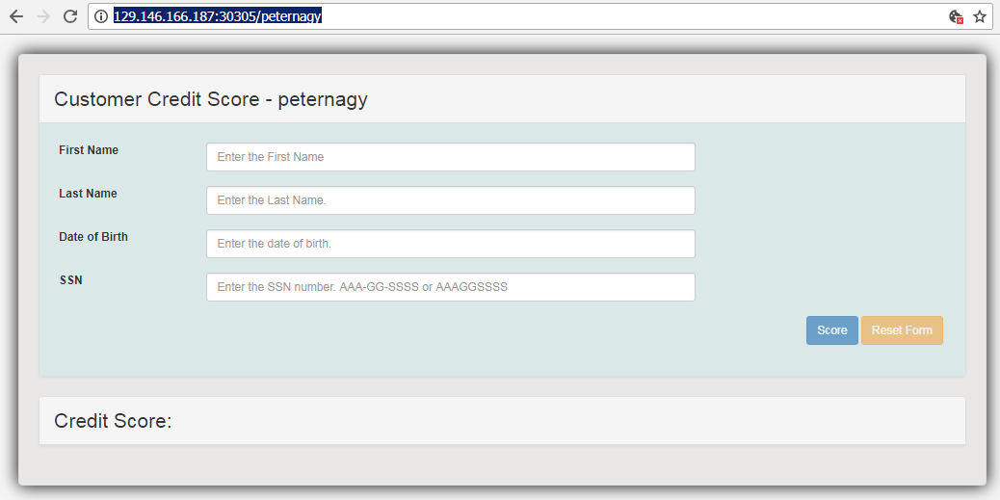

Test the application. You can also check the deployed application on the WebLogic Administration console. Open the console using any of the Node IP address, WebLogic port number (30701 or what you get during pipeline setup) and appending */console*. Log in using administrator's credentials and click **Deployments**.

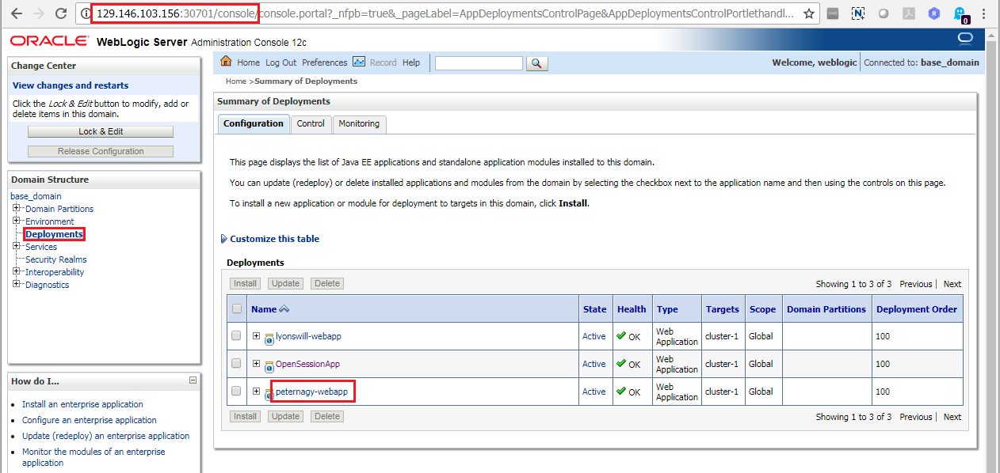