# Technical Fast Start to create Oracle Container Engine for Kubernetes (OKE) on Oracle Cloud Infrastructure (OCI) #

Oracle Cloud Infrastructure Container Engine for Kubernetes is a fully-managed, scalable, and highly available service that you can use to deploy your containerized applications to the cloud. Use Container Engine for Kubernetes (sometimes abbreviated to just OKE) when your development team wants to reliably build, deploy, and manage cloud-native applications. You specify the compute resources that your applications require, and Container Engine for Kubernetes provisions them on Oracle Cloud Infrastructure in an existing OCI tenancy.

### Prerequisites ###

[Oracle Cloud Infrastructure](https://cloud.oracle.com/en_US/cloud-infrastructure) enabled account.

To create Container Engine for Kubernetes (OKE) the following steps needs to be completed:

- Create compartment.
- Create service policy which allows OKE to create resources.
- Create network resources (VCN, Subnets, Security lists, etc.)
- Create Cluster.
- Create NodePool.

More information:

- [Oracle Container Engine documentation](https://docs.us-phoenix-1.oraclecloud.com/Content/ContEng/Concepts/contengoverview.htm)
- [About Kubernetes Clusters and Nodes](https://docs.us-phoenix-1.oraclecloud.com/Content/ContEng/Concepts/contengclustersnodes.htm)

#### Open the OCI console ####

Sign in to your cloud account and open OCI console.

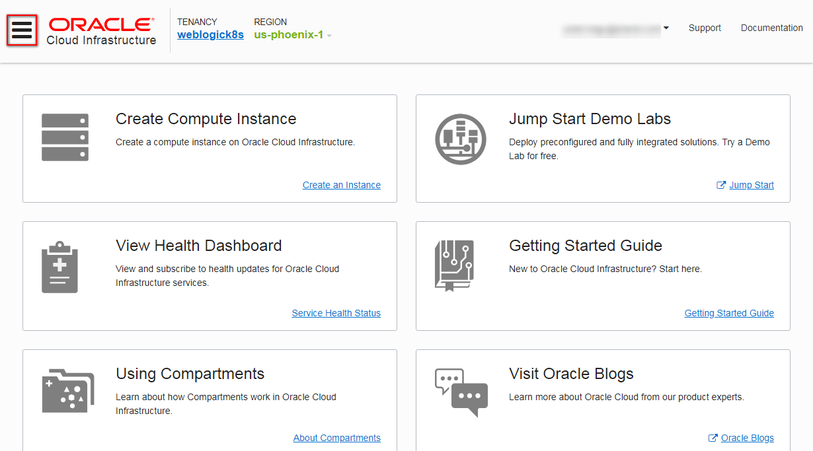

---
**NOTE!** Some accounts utilize Federated Identity, which OKE does not support at this time. In order to use OKE in one of these accounts, you need to [create a native OCI Identity User](https://docs.us-phoenix-1.oraclecloud.com/Content/GSG/Tasks/addingusers.htm).

---

#### Create compartment ####

A cluster is created on an existing VCN in a compartment. You should select an existing compartment or create a new one to locate your cluster. To create a compartment open the navigation menu.

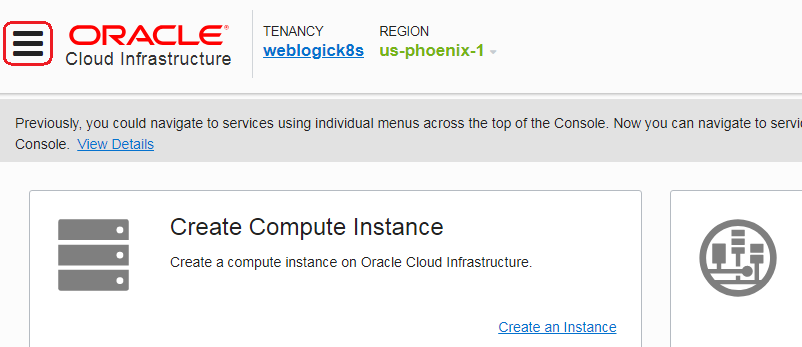

Under Identity, click **Compartments**.

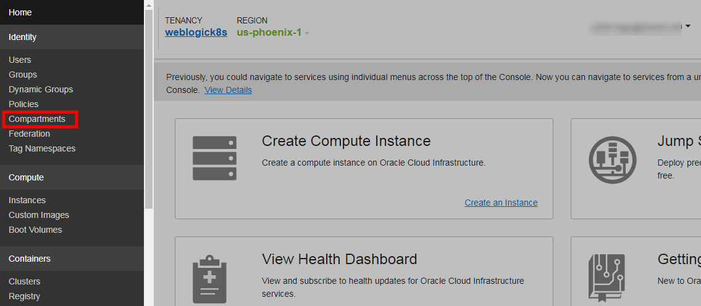

Click on **Create Compartment** button.

Enter the following:

- **Name:** A unique name for the compartment (maximum 100 characters, including letters, numbers, periods, hyphens, and underscores).
- **Description:** A friendly description.
- **Tags:** Optionally, you can apply tags. 
Click **Create Compartment**.

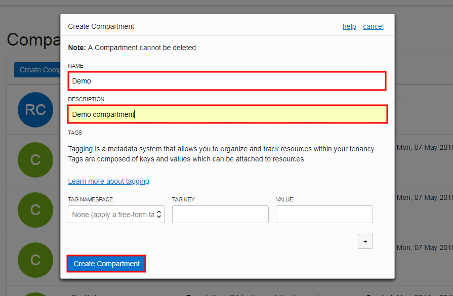

---

**NOTE!** Compartments can't be deleted.

---

#### Create Policy ####

A service policy allows OKE to create resources in tenancy such as compute. An OKE resource policy or policies enables you to regulate which groups in your tenancy can do what with the OKE API.

Optionally create more resource policy if you want to regulate which groups can access different parts of the OKE service.

Open the navigation menu. Under **Identity**, click **Policies**.

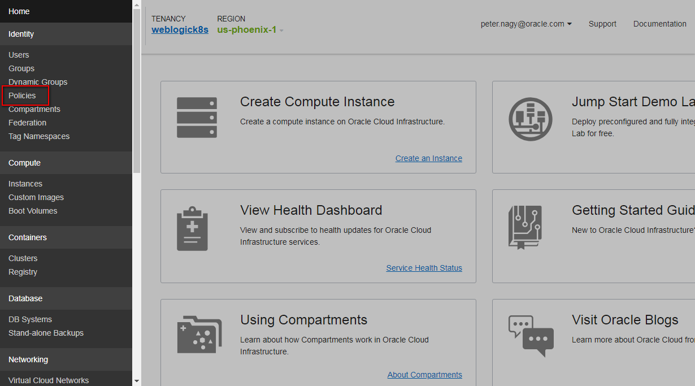

A list of the policies in the compartment you're viewing is displayed. 
If you want to attach the policy to a compartment other than the one you're viewing, select the desired compartment from the list on the left.
Click **Create Policy**.

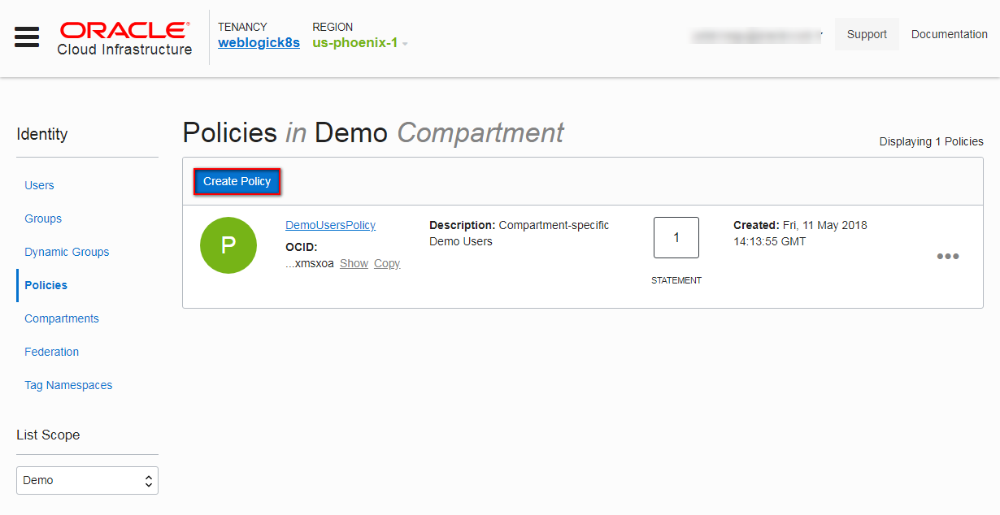

Enter the following:

- **Name:** A unique name for the policy. The name must be unique across all policies in your tenancy. You cannot change this later.
- **Description:** A friendly description.
- **Policy Versioning:** Select **Keep Policy Current**. It ensures that the policy stay current with any future changes to the service's definitions of verbs and resources.
- **Statement:** A policy statement. It MUST be: `allow service OKE to manage all-resources in tenancy`
- **Tags:** Optionally, you can apply tags.

Click **Create**.

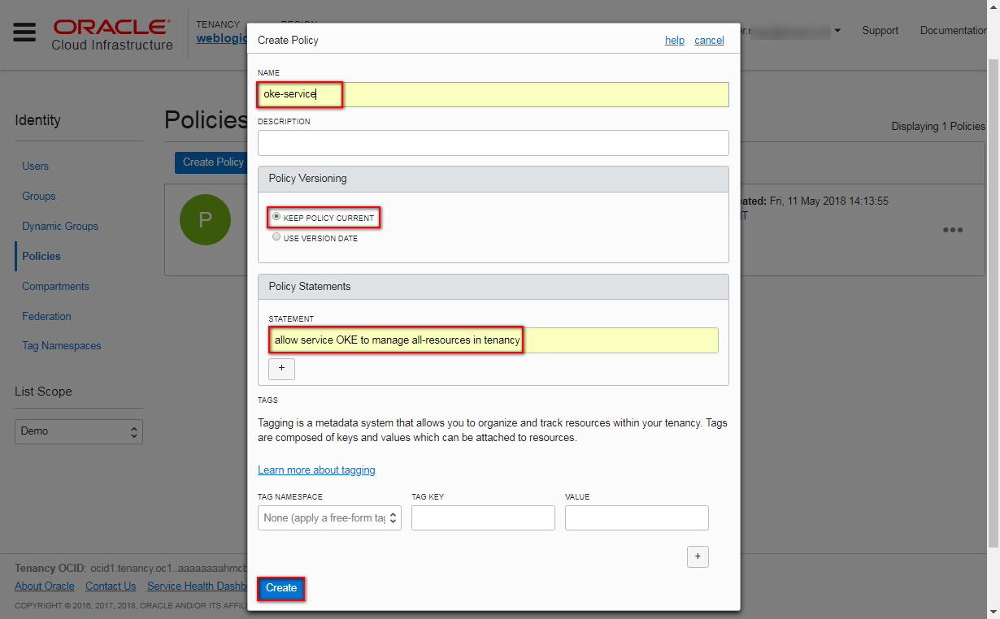

#### Network Resources ####

In order to deploy an OKE cluster the compartment must contain the necessary network resources already configured: VCN, subnets, internet gateway, route table, security lists. 

##### Virtual Cloud Network #####

The Virtual Cloud Network (VCN) is a private network that you set up in the Oracle data centers, with firewall rules and specific types of communication gateways that you can choose to use.

To create a highly available cluster spanning three availability domains, the VCN must include three subnets in different availability domains for node pools, and two further subnets for load balancers.

Open the navigation menu. Under **Networking**, click **Virtual Cloud Networks**.

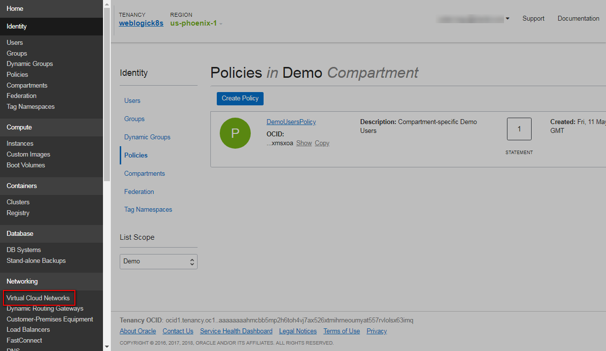

Choose a compartment you have permission to work in (on the left side of the page). The page updates to display only the resources in that compartment. Click **Create Virtual Cloud Network**.

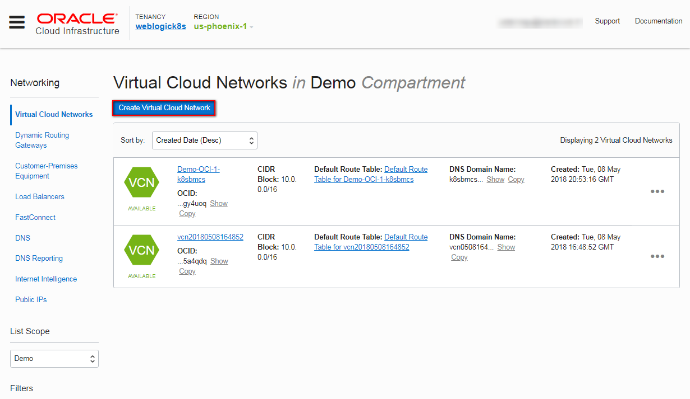

Enter the following:

- **Create in Compartment:** Leave as is.
- **Name:** A friendly name for the cloud network. E.g. *VCN-Cluster-1*
- **Create Virtual Cloud Network Only:** Make sure this radio button is selected.
- **CIDR Block:** A single, contiguous CIDR block for the cloud network. You cannot change this value later. 
- **DNS Resolution:** Select the Use DNS Hostnames in this VCN checkbox. 
- **DNS Label:** Specify a DNS label for the VCN.  Basically the Console will generate one for you. The dialog box automatically displays the corresponding DNS Domain Name for the VCN (<VCN DNS label>.oraclevcn.com). 
- **Tags:** Optionally, you can apply tags.

Click Create Virtual Cloud Network.

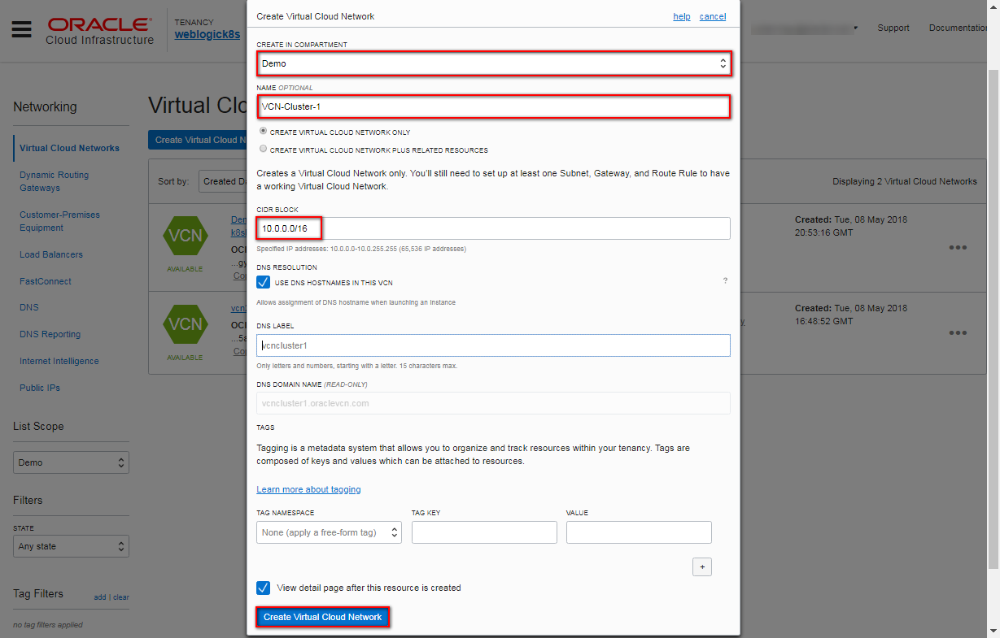

##### Security lists #####

A security list provides a virtual firewall for an instance, with ingress and egress rules that specify the types of traffic allowed in and out. Each security list is enforced at the instance level. However, you configure your security lists at the subnet level, which means that all instances in a given subnet are subject to the same set of rules. The security lists apply to a given instance whether it's talking with another instance in the VCN or a host outside the VCN.

On the **Networking** page select **Security Lists**. OKE requires at least two lists: one for worker nodes and one for the load balancer. 

First define the security list for worker node(s). Before create the rules identify your IP address what is neccessary to open up the correct IP range to enable incoming traffic from your desktop to the cluster services. You can easily get your visible IP address using a google search: [https://www.google.hu/search?q=myip](https://www.google.hu/search?q=myip). Note the result and replace when you need type **<MY\_IP\_ADDRESS>**.

Click **Create Security List** to create new security list.

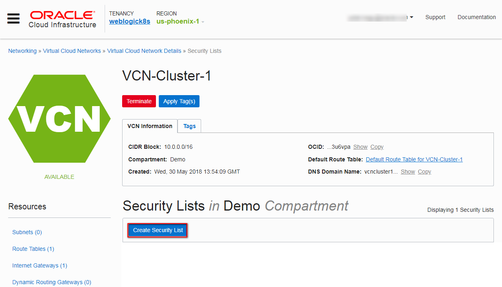

Enter the following:

- **Create in Compartment:** The compartment where you want to create the security list, if different from the compartment you're currently working in. 
- **Security List Name:** A friendly name for the security list e.g. *worker node seclist*
- **Ingress rules:**

| Type      | Source        | Protocol                    | Type/Source Port       | Destination Port           |Notes
|-----------|---------------|-----------------------------|------------------------|----------------------------|----------------------------------------------|
| Stateless | 10.0.10.0/24  | IP Protocol:  All Protocols |                        |                            |For intra-VCN traffic                         |
| Stateless | 10.0.11.0/24  | IP Protocol:  All Protocols |                        |                            |For intra-VCN traffic                         |
| Stateless | 10.0.12.0/24  | IP Protocol:  All Protocols |                        |                            |For intra-VCN traffic                         |
| Stateful  | 0.0.0.0/0     | IP Protocol: ICMP           | Type and Code: 3,4     |                            |                                              |
| Stateful  | 130.35.0.0/16 | IP Protocol: TCP            | Source Port Range: All | Destination Port Range: 22 |For the OCI Clusters service to access workers|
| Stateful  | 138.1.0.0/17  | IP Protocol: TCP            | Source Port Range: All | Destination Port Range: 22 |For the OCI Clusters service to access workers|
| Stateful  | **<MY\_IP\_ADDRESS>**/32  | IP Protocol: TCP            | Source Port Range: All | Destination Port Range: All |For your desktop to access workers|
| Stateful  | 0.0.0.0/0  | IP Protocol: TCP            | Source Port Range: All | Destination Port Range: 30701 |To access WebLogic Administration console in case if you [deploy WebLogic Domain](setup.weblogic.kubernetes.md).|
| Stateful  | 0.0.0.0/0  | IP Protocol: TCP            | Source Port Range: All | Destination Port Range: 30305 |Enable Traefik's traffic in case if you [deploy WebLogic Domain](setup.weblogic.kubernetes.md).|

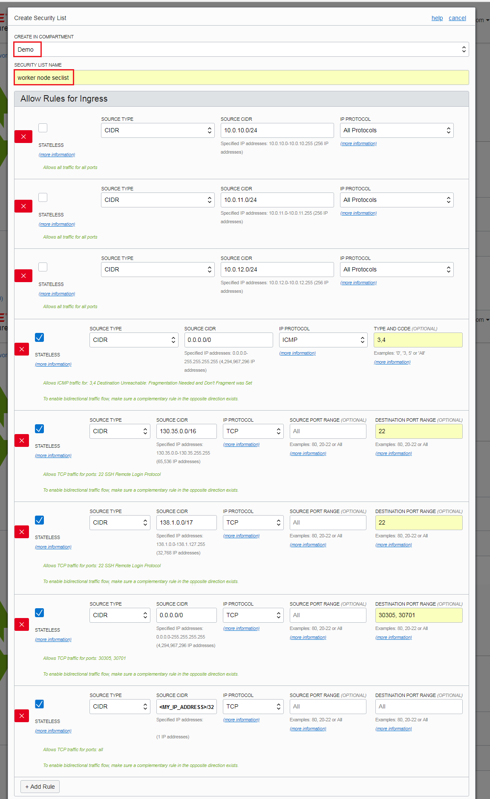

- **Egress rules:**

| Type      | Source       | Protocol                   |Notes
|-----------|--------------|----------------------------|-----------------------------------|
| Stateless | 10.0.10.0/24 | IP Protocol: All Protocols |For intra-VCN traffic              |
| Stateless | 10.0.11.0/24 | IP Protocol: All Protocols |For intra-VCN traffic              |
| Stateless | 10.0.12.0/24 | IP Protocol: All Protocols |For intra-VCN traffic              |
| Stateful  | 0.0.0.0/0    | IP Protocol: All Protocols |For outbound access to the internet|

Click **Create**.

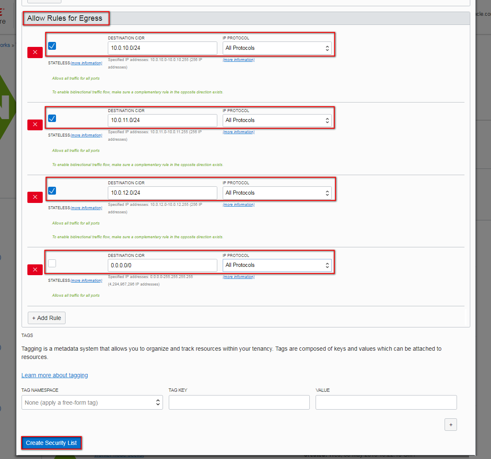

---

**NOTE!** It is highly not recommended to open up the entire range (0.0.0.0/0), protocols and ports to communicate to worker nodes. In this case anyone can e.g. SSH from anywhere which opens up the instances for attacks. When the application is known then define specific port and source IP (range) to ensure highest security.

---

Create a another security list for loadbalancer. Click again **Create Security List**.

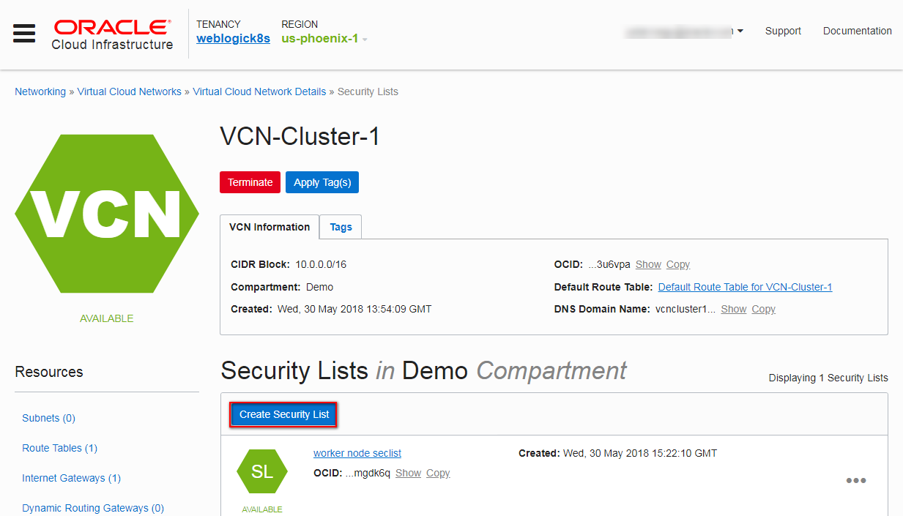

Enter the following:

- **Create in Compartment:** The compartment where you want to create the security list, if different from the compartment you're currently working in. 
- **Security List Name:** A friendly name for the security list e.g. *loadbalancer seclist*
- **Ingress rules:**

| Type      | Source        | Protocol                    | Type/Source Port       | Destination Port           |Notes
|-----------|---------------|-----------------------------|------------------------|----------------------------|-----------------------------------------------------|
| Stateless | 0.0.0.0/0     | IP Protocol: TCP            | Source Port Range: All | Destination Port Range: All|For incoming public traffic to service load balancers|

- **Egress rules:**

| Type      | Source        | Protocol                    | Type/Source Port       | Destination Port           |Notes
|-----------|---------------|-----------------------------|------------------------|----------------------------|---------------------------------------------------------------------|
| Stateless | 0.0.0.0/0     | IP Protocol: TCP            | Source Port Range: All | Destination Port Range: All|For responses from your application through the service load balancers|

Click **Create**.

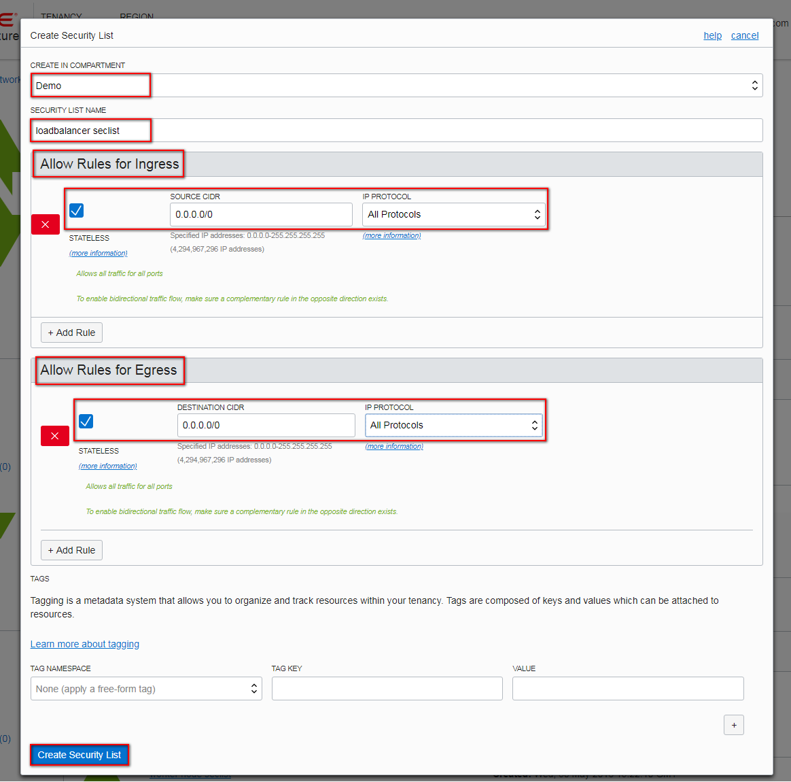

##### Internet Gateway #####

To give the VCN access to the internet it requires an Internet Gateway as well as a default route to the gateway. You can think of an internet gateway as a router connecting the edge of the cloud network with the internet. Traffic that originates in your VCN and is destined for a public IP address outside the VCN goes through the internet gateway.

For traffic to flow between a subnet and an internet gateway, you must create a route rule accordingly in the subnet's route table (for example, 0.0.0.0/0 > internet gateway).

On the **Virtual Cloud Network** page click **Internet Gateways**. To create a new one click **Create Internet Gateway**.

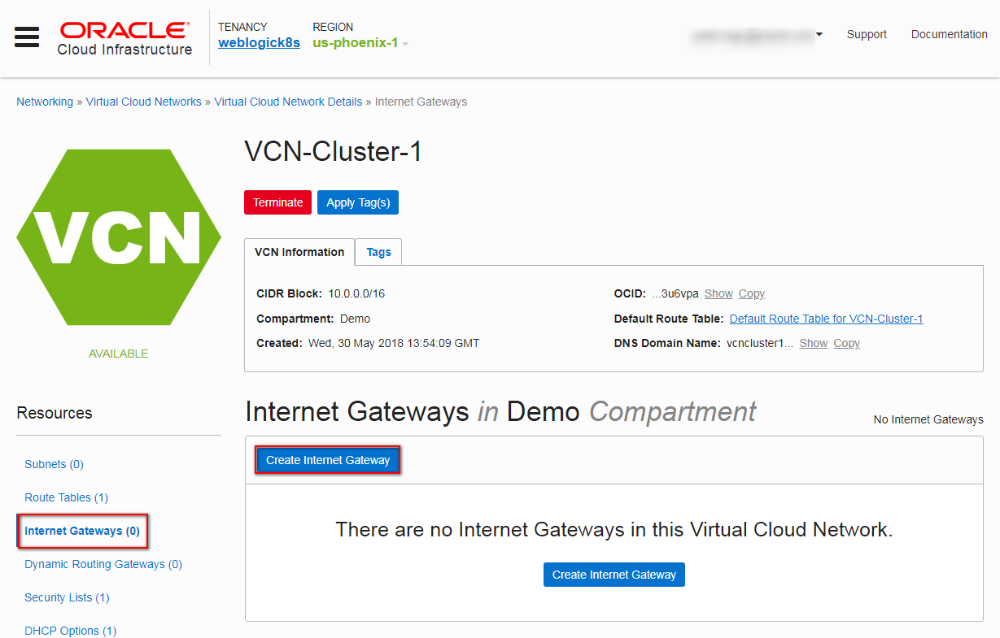

Enter the following:

- **Create in Compartment:** The compartment where you want to create the internet gateway, if different from the compartment you're currently working in.
- **Name:** A friendly name for the internet gateway. For example *ig-cluster-1*
- **Tags:** Optionally, you can apply tags. 

Click **Create**.

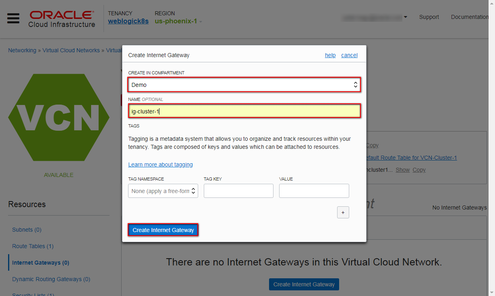

##### Route Tables #####

Cloud network uses virtual route tables to send traffic out of the VCN (for example, to the Internet or to your on-premises network). These virtual route tables have rules that look and act like traditional network route rules you might already be familiar with. Each rule specifies a destination CIDR block and the target (the next hop) for any traffic that matches that CIDR.

While viewing the VCN's details, click **Route Tables**. Click the default route table to view its details.

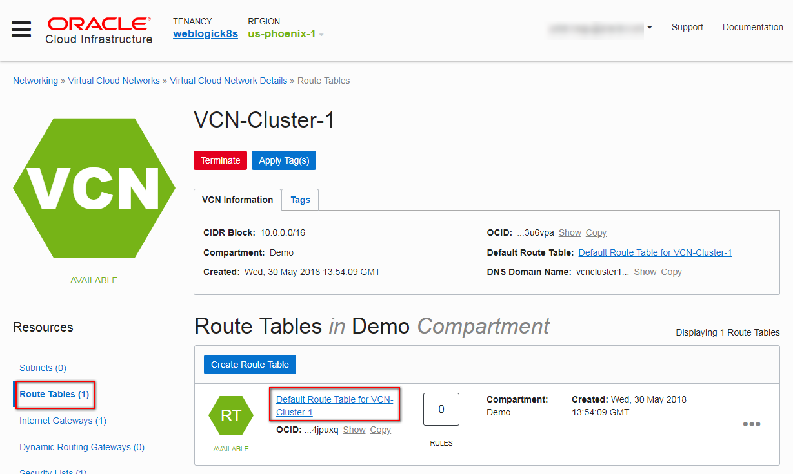

Click **Edit Route Rules**.

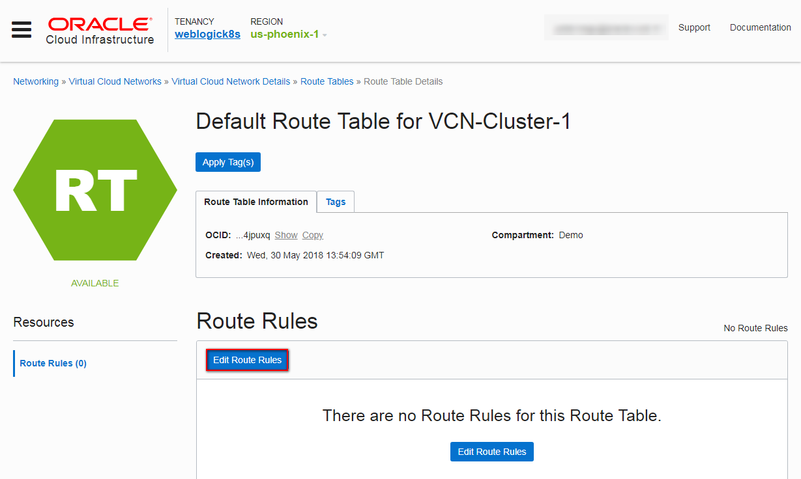

Click **+Another Route Rule**.

Enter the following:

- **Destination CIDR block:** `0.0.0.0/0` (which means that all non-intra-VCN traffic that is not already covered by other rules in the route table will go to the target specified in this rule)
- **Target Type:** *Internet Gateway*
- **Compartment:** The compartment where the internet gateway is located.
- **Target:** The internet gateway you just created.

Click **Save**.

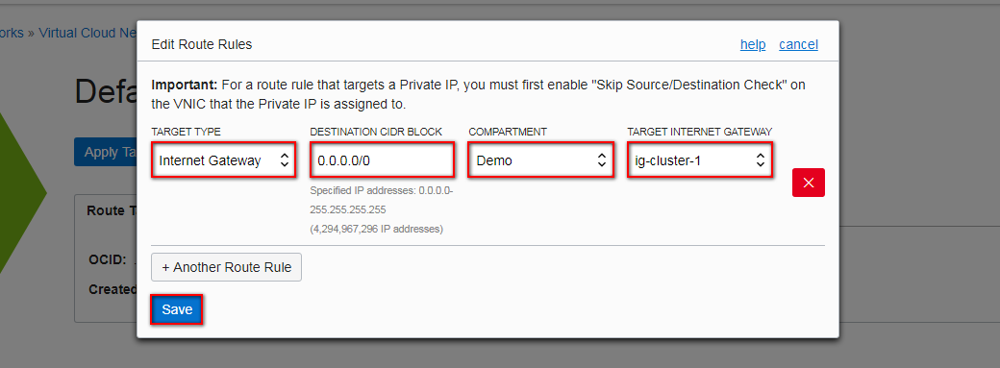

##### Subnets #####

A cloud network is a software-defined network that you set up in Oracle data centers. A subnet is a subdivision of a cloud network. You can privately connect a VCN to another VCN in the same region so that the traffic does not traverse the internet. The CIDRs for the two VCNs must not overlap.

Each subnet in a VCN exists in a single availability domain and consists of a contiguous range of IP addresses that do not overlap with other subnets in the cloud network. Example: 172.16.1.0/24. The first two IP addresses and the last in the subnet's CIDR are reserved by the Networking service. You can't change the size of the subnet after creation, so it's important to think about the size of subnets you need before creating them. Also, the subnet acts as a unit of configuration: all instances in a given subnet use the same route table, security lists, and DHCP options.

In this scenario 5 subnets are required. 

- 3 subnets will be used to deploy (3) worker nodes. Each one should of those subnets should be in a different Availability Domain.
- 2 subnets will be used for hosting load balancers. Each of those should be in a different availability domain.

First create for the loadbalancers.

While viewing the VCN's details, click **Create Subnet**.

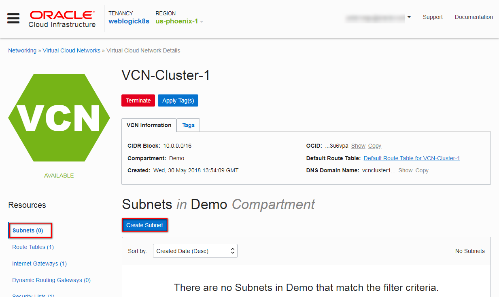

In the Create Subnet dialog box, you specify the resources to associate with the subnet (for example, a route table, and so on). By default, the subnet will be created in the current compartment, and you'll choose the resources from the same compartment. 

Enter the following:

- **Name:** A friendly name for the subnet. For example: *cluster-1-loadbalancers-1*
- **Availability Domain:** The availability domain for the subnet. Any instances you later launch into this subnet will also go into this availability domain. In our example it is *PHX-AD-1*.
- **CIDR Block:** A single, contiguous CIDR block for the subnet: `10.0.20.0/24`. You cannot change this value later. 
- **Route Table:** The route table to associate with the subnet. Select the default route table what you have modified in the previous steps.
- **Private or public subnet:** Select *PUBLIC SUBNET*. This means the  VNICs in the subnet can have public IP addresses.
- **Use DNS Hostnames in this Subnet:** Leave default which has to be selected. 
- **DNS Label:** The Console will generate one based on the VCN DNS label. However modify to: *cluster1lb1*
- **DHCP Options:** Select the available default DHCP options for your VCN.
- **Security Lists:** Select the previously created *loadbalancer seclist* security list.
- **Tags:** Optionally, you can apply tags.

Click **Create**.

Now repeate the subnet creation but use different name, CIDR, DNS label and availability domain. Click **Create Subnet**.

Enter the following:

- **Name:** A friendly name for the subnet. For example: *cluster-1-loadbalancers-2*
- **Availability Domain:** The availability domain for the subnet. Any instances you later launch into this subnet will also go into this availability domain. In our example it is *PHX-AD-2*.
- **CIDR Block:** A single, contiguous CIDR block for the subnet: `10.0.21.0/24`. You cannot change this value later. 
- **Route Table:** The route table to associate with the subnet. Select the default route table what you have modified in the previous steps.
- **Private or public subnet:** Select *PUBLIC SUBNET*. This means the  VNICs in the subnet can have public IP addresses.
- **Use DNS Hostnames in this Subnet:** Leave default which has to be selected. 
- **DNS Label:** The Console will generate one based on the VCN DNS label. However modify to: *cluster1lb2*
- **DHCP Options:** Select the available default DHCP options for your VCN.
- **Security Lists:** Select the same *loadbalancer seclist* security list what you created in the previous steps.
- **Tags:** Optionally, you can apply tags.

Click **Create**.

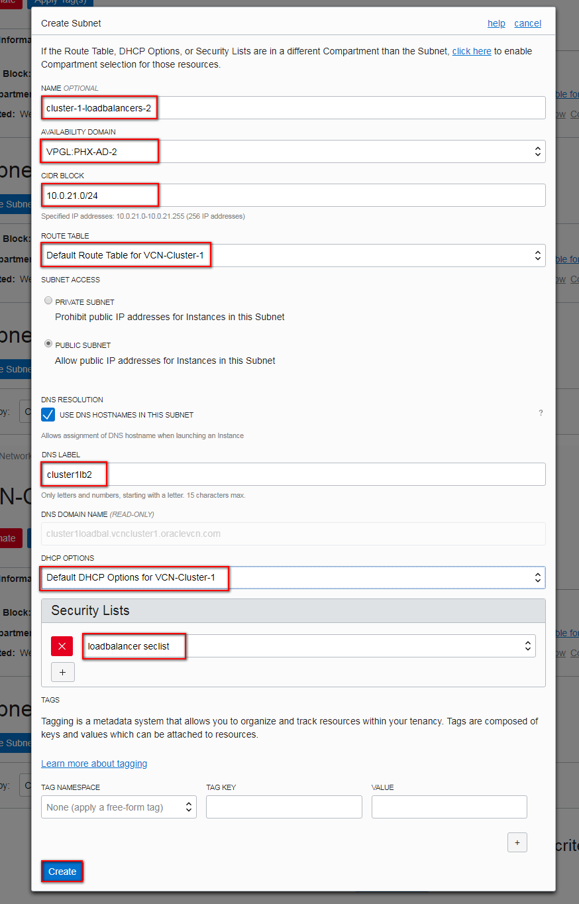

Loadbalancers subnets are ready. Now create 3 subnets for the 3 worker node.

Click **Create Subnet**.

Enter the following:

- **Name:** A friendly name for the subnet. For example: *worker-subnet-1*
- **Availability Domain:** The availability domain for the subnet. Any instances you later launch into this subnet will also go into this availability domain. In our example it is *PHX-AD-1*.
- **CIDR Block:** A single, contiguous CIDR block for the subnet: `10.0.10.0/24`. You cannot change this value later. 
- **Route Table:** The route table to associate with the subnet. Select the default route table what you have modified in the previous steps.
- **Private or public subnet:** Select *PUBLIC SUBNET*. This means the  VNICs in the subnet can have public IP addresses.
- **Use DNS Hostnames in this Subnet:** Leave default which has to be selected. 
- **DNS Label:** The Console will generate one based on the VCN DNS label. However modify to: *workersubnet1*
- **DHCP Options:** Select the available default DHCP options for your VCN.
- **Security Lists:** Select the same *worker node seclist* security list what you created in the previous steps.
- **Tags:** Optionally, you can apply tags.

Click **Create**.

Click **Create Subnet** to create the subnet for the second worker node.

Enter the following:

- **Name:** A friendly name for the subnet. For example: *worker-subnet-2*
- **Availability Domain:** The availability domain for the subnet. Any instances you later launch into this subnet will also go into this availability domain. In our example it is *PHX-AD-1*.
- **CIDR Block:** A single, contiguous CIDR block for the subnet: `10.0.11.0/24`. You cannot change this value later. 
- **Route Table:** The route table to associate with the subnet. Select the default route table what you have modified in the previous steps.
- **Private or public subnet:** Select *PUBLIC SUBNET*. This means the  VNICs in the subnet can have public IP addresses.
- **Use DNS Hostnames in this Subnet:** Leave default which has to be selected. 
- **DNS Label:** The Console will generate one based on the VCN DNS label. However modify to: *workersubnet2*
- **DHCP Options:** Select the available default DHCP options for your VCN.
- **Security Lists:** Select the same *worker node seclist* security list what you created in the previous steps.
- **Tags:** Optionally, you can apply tags.

Click **Create**.

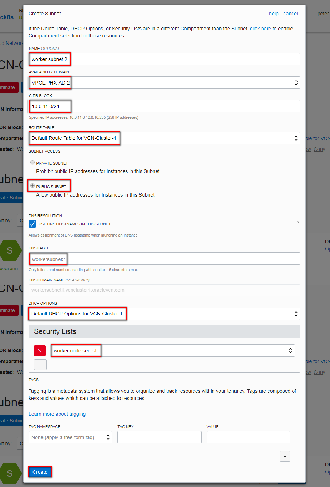

Click **Create Subnet** to create the subnet for the third worker node.

Enter the following:

- **Name:** A friendly name for the subnet. For example: *worker-subnet-3*
- **Availability Domain:** The availability domain for the subnet. Any instances you later launch into this subnet will also go into this availability domain. In our example it is *PHX-AD-1*.
- **CIDR Block:** A single, contiguous CIDR block for the subnet: `10.0.12.0/24`. You cannot change this value later. 
- **Route Table:** The route table to associate with the subnet. Select the default route table what you have modified in the previous steps.
- **Private or public subnet:** Select *PUBLIC SUBNET*. This means the  VNICs in the subnet can have public IP addresses.
- **Use DNS Hostnames in this Subnet:** Leave default which has to be selected. 
- **DNS Label:** The Console will generate one based on the VCN DNS label. However modify to: *workersubnet3*
- **DHCP Options:** Select the available default DHCP options for your VCN.
- **Security Lists:** Select the same *worker node seclist* security list what you created in the previous steps.
- **Tags:** Optionally, you can apply tags.

Click **Create**.

Now your subnet list should like the this:

##### Create Cluster #####

Now you have all the necessary resources to create OKE cluster. First specify details for the cluster (for example, the Kubernetes version to install on master nodes). Having defined the cluster, you typically specify details for different node pools in the cluster (for example, the node shape, or resource profile, that determines the number of CPUs and amount of memory assigned to each worker node). Note that although you will usually define node pools immediately when defining a cluster, you don't have to. You can create a cluster with no node pools, and add node pools later.

In the **Console**, open the navigation menu. Click **Containers**. Choose a Compartment you have permission to work in, and then click Clusters. Click **Create Cluster**.

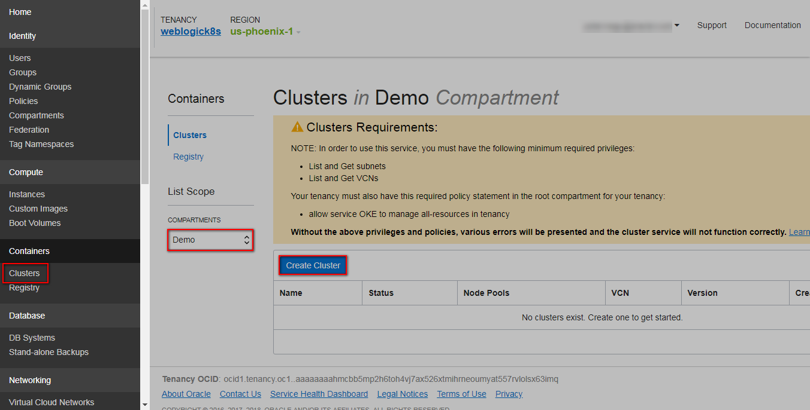

Specify configuration details for the new cluster:

- **Name:** A name of your choice for the new cluster. For example *demo-cluster-1*
- **Version:** The version of Kubernetes to run on the master node of the cluster. Select the currently available latest *v1.9.7*.
- **VCN:** The name of the VCN what you created earlier. If you followed the guide it is: *VCN-Cluster-1*
- **Kubernetes Service LB Subnets:** The two subnets configured to host load balancers. These are: *cluster1-loadblanacer-1*, *cluster1-loadblanacer-2*
- **Kubernetes Service CIDR Block:** The available group of network addresses that can be exposed as Kubernetes services (ClusterIPs), expressed as a single, contiguous IPv4 CIDR block. Enter: `10.96.0.0/16`. (The CIDR block you specify must not overlap with the CIDR block for the VCN.)
- Pods CIDR Block: The available group of network addresses that can be allocated to pods running in the cluster, expressed as a single, contiguous IPv4 CIDR block. Enter: `10.244.0.0/16`. (The CIDR block you specify must not overlap with the CIDR blocks for subnets in the VCN, and can be outside the VCN CIDR block.)
- **Kubernetes Dashboard Enabled:** Leave the default selected to use the Kubernetes Dashboard to deploy and troubleshoot containerized applications, and to manage Kubernetes resources.
- **Tiller (Helm) Enabled:** Leave default selected. With Tiller running in the cluster, you can use Helm to manage Kubernetes resources.

Click **Add a Node Pool**.

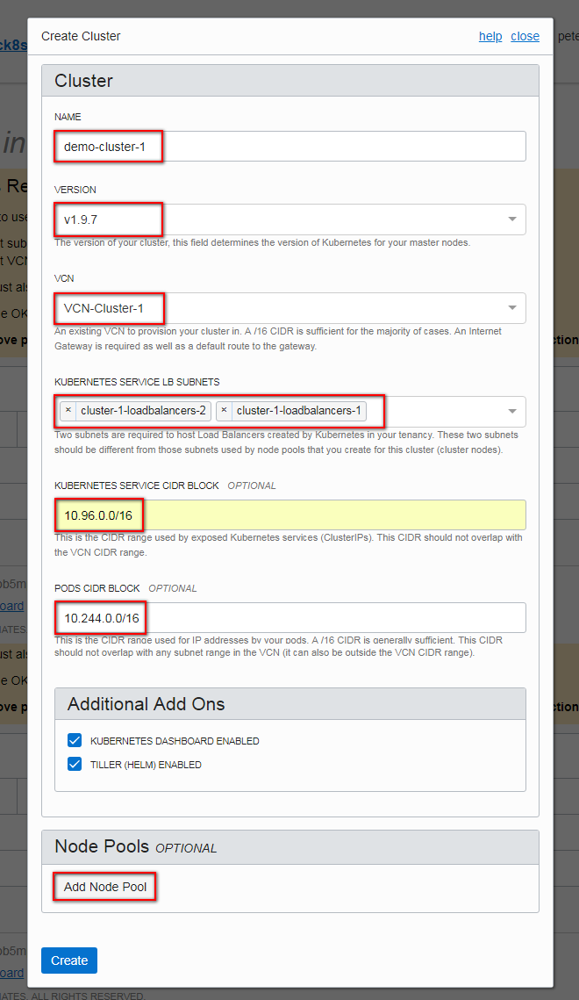

Specify configuration details for the first node pool in the cluster:

- **Name:** A name of your choice for the new node pool. For example: *demo cluster 1 node pool*
- **Version:** The version of Kubernetes to run on each worker node in the node pool. By default, the version of Kubernetes specified for the master node is selected. The Kubernetes version on worker nodes must be either the same version as that on the master node, or an earlier version that is still compatible. Select: *v1.9.7*.
- **Image:** The image to use on each node in the node pool. An image is a template of a virtual hard drive that determines the operating system and other software for the node. Select: *Oracle-Linux-7.4*
- **Shape:** Select the smallest *VM.Standard1.1*.
- **Subnet:** Select the *worker node 1/2/3* subnets configured to host worker nodes.
- **Quantity per Subnet:** The number of worker nodes to create for the node pool in each subnet. Enter *1*.
- **Public SSH Key:** The public key portion of the key pair you need to use for SSH access to each node in the node pool. The public key is installed on all worker nodes in the cluster. If you need help to create ssh key pair follow this [tutorial](ssh.keypair.gen.md).

Click create.

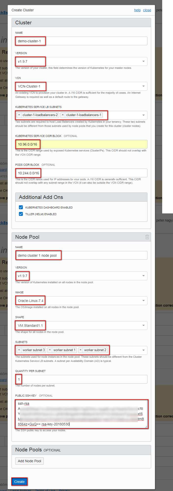

Container Engine for Kubernetes starts creating the cluster. Initially, the new cluster appears in the list of clusters with a status of Creating. When the cluster has been created, it has a status of *Active*.

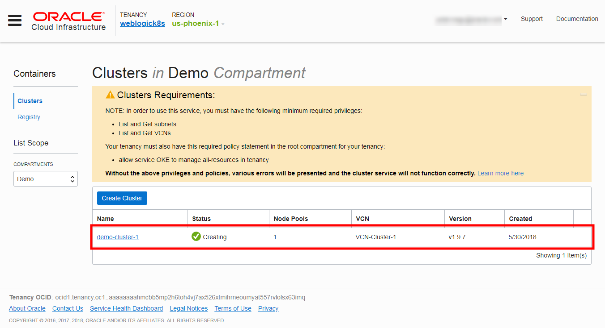

Click on cluster name *demo-cluster-1* to view the details. When the nodes have been created and configured, they have *Active* status. Note the Public IP addresses assigned to the nodes.

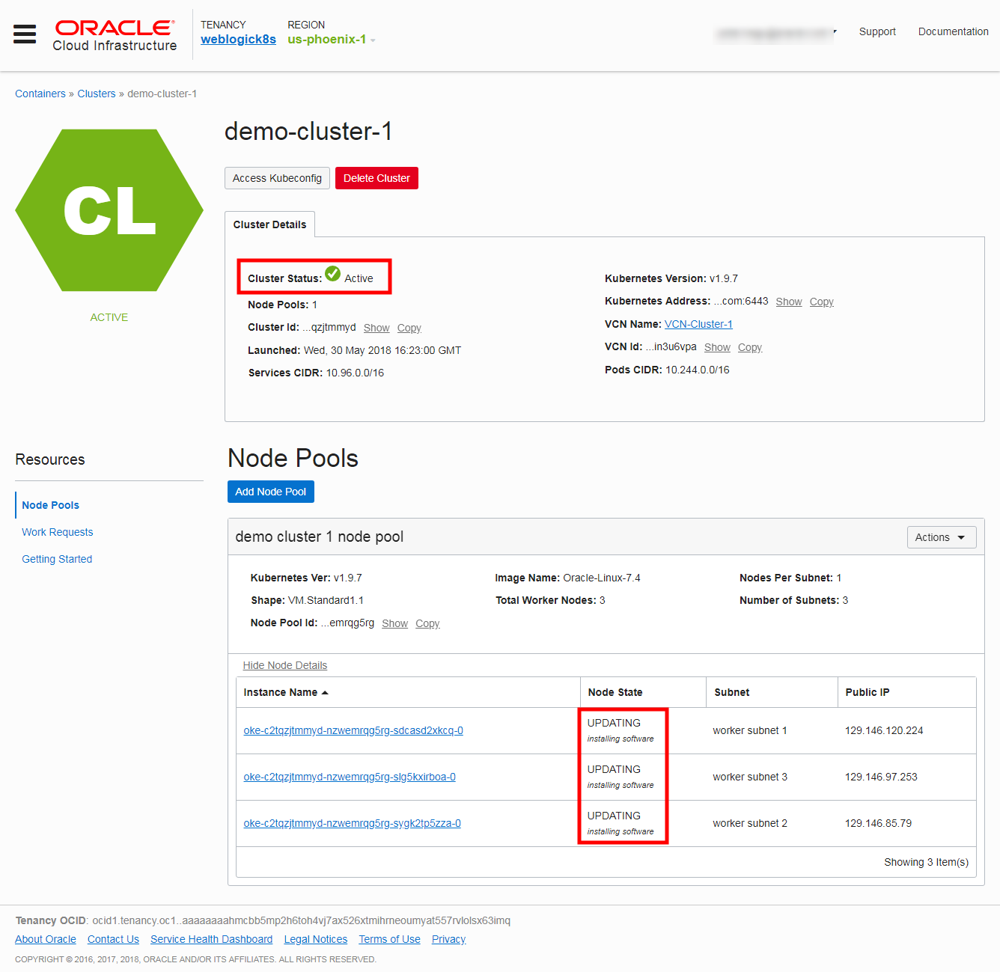

##### Configure kubectl #####

To get kubernetes configuration first you need to install OCI CLI. For Linux execute the following command which will install the CLI and dependencies.

	bash -c "$(curl -L https://raw.githubusercontent.com/oracle/oci-cli/master/scripts/install/install.sh)"

For Windows see the [documentation](https://docs.us-phoenix-1.oraclecloud.com/Content/API/SDKDocs/cliinstall.htm).

To check the installation query the version info.

	[oracle@localhost kubernetes]$ oci -v
	2.4.23

Before using the CLI, you have to create a config file that contains the required credentials for working with Oracle Cloud Infrastructure. To have the CLI walk you through the first-time setup process, step by step, use the `oci setup config` command. The command prompts you for the information required for the config file and the API public/private keys. The setup dialog generates an API key pair and creates the config file.

Before you start the setup collect the necessary information using your OCI console.

- User OCID
- Tenancy OCID
- Region

In the **Console** click on your OCI user name and select **User Settings**. On the user details page you can find all the necessary information. In the middle of the page under **User Information** tab you can find the *user OCID*. Click **Copy** when needed to get on clipboard. At the bottom of the page you can find the tenancy OCID what you have to select and copy. Finally, if you are not aware note your region at the top of the page.

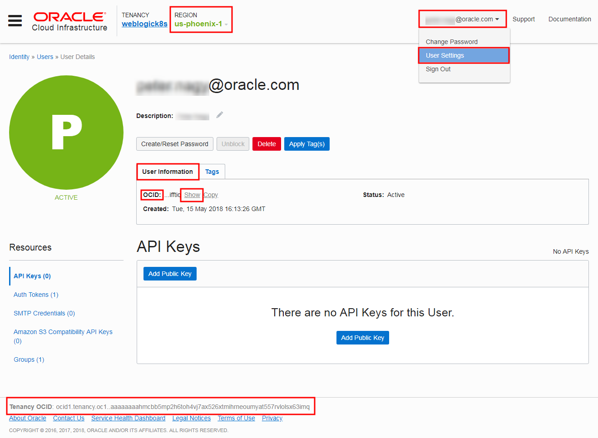

Leave the console open during CLI configuration and copy the required information from the console page. When you want to accept the default value what is offered in square bracket just hit Enter. 

Execute `oci setup config` command to setup the CLI:

	[oracle@localhost kubernetes]$ oci setup config
	    This command provides a walkthrough of creating a valid CLI config file.
	
	    The following links explain where to find the information required by this
	    script:
	
	    User OCID and Tenancy OCID:
	
	        https://docs.us-phoenix-1.oraclecloud.com/Content/API/Concepts/apisigningkey.htm#Other
	
	    Region:
	
	        https://docs.us-phoenix-1.oraclecloud.com/Content/General/Concepts/regions.htm
	
	    General config documentation:
	
	        https://docs.us-phoenix-1.oraclecloud.com/Content/API/Concepts/sdkconfig.htm
	
	
	Enter a location for your config [/home/oracle/.oci/config]: 
	Enter a user OCID: <YOUR_USER_OCID>
	Enter a tenancy OCID: <YOUR_TENANCY_OCID> Enter a region (e.g. eu-frankfurt-1, uk-london-1, us-ashburn-1, us-phoenix-1): <YOUR_REGION>
	Do you want to generate a new RSA key pair? (If you decline you will be asked to supply the path to an existing key.) [Y/n]: Y
	Enter a directory for your keys to be created [/home/oracle/.oci]: 
	Enter a name for your key [oci_api_key]: 
	Public key written to: /home/oracle/.oci/oci_api_key_public.pem
	Enter a passphrase for your private key (empty for no passphrase): 
	Private key written to: /home/oracle/.oci/oci_api_key.pem
	Fingerprint: 41:ea:cf:23:01:a2:bb:fb:84:79:34:8e:fe:bc:18:4f
	Config written to /home/oracle/.oci/config
	
	
	    If you haven't already uploaded your public key through the console,
	    follow the instructions on the page linked below in the section 'How to
	    upload the public key':
	
	        https://docs.us-phoenix-1.oraclecloud.com/Content/API/Concepts/apisigningkey.htm#How2
	
	
	[oracle@localhost kubernetes]$ 

The final step to complete the CLI setup to upload your freshly generated public key through the console. The public key if you haven't changed during setup can be found in the `/home/oracle/.oci/` directory and it's name `oci_api_key_public.pem`. Using your favourite way copy its content to the clipboard. While viewing user details click **Add Public Key**.

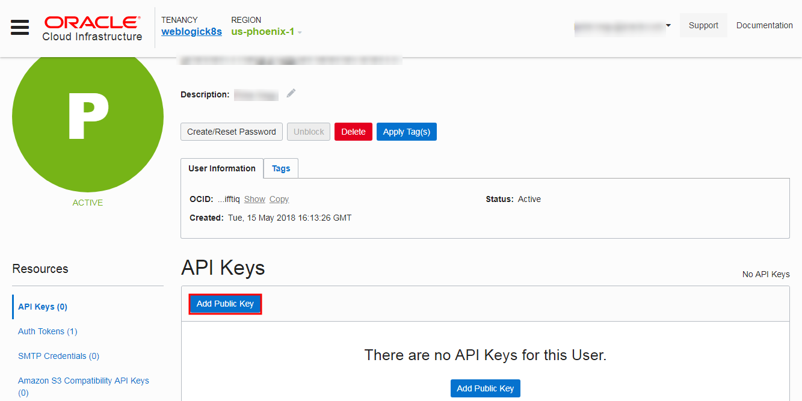

Copy the content of the `oci_api_key_public.pem` file into the *PUBLIC KEY* text area and click **Add**.

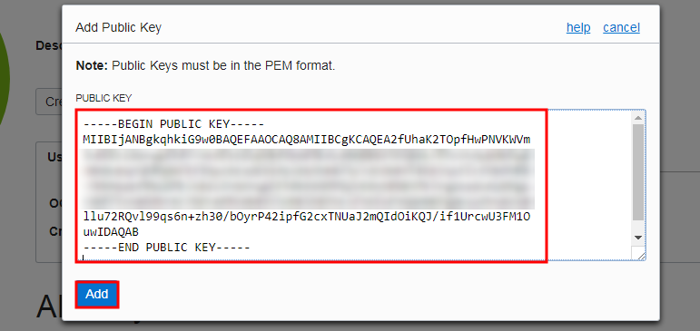

The CLI setup now is done. To complete the `kubectl` configuration open the navigation menu and under **Containers**, click **Clusters**. Select your cluster and click to get the detail page.

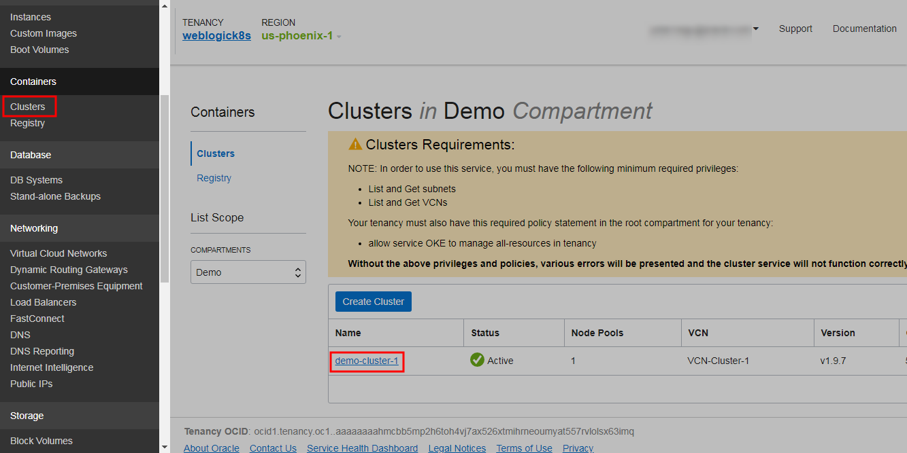

Click **Get Started**.

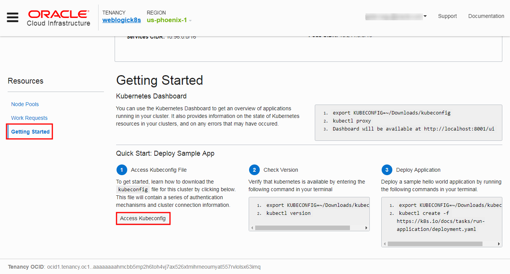

Currently OCI CLI for container engine is not available thus you need to download a script which will generate *kubeconfig* using your OCI CLI configuration (authentication). Click **Download script**.

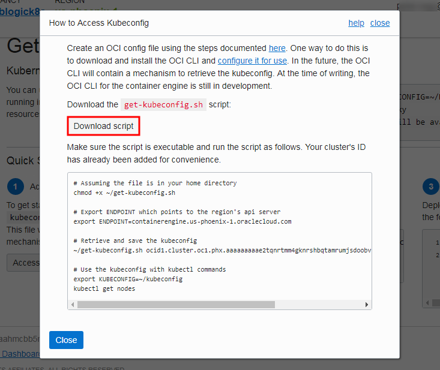

Then copy the commands from the text are below to execute the downloaded script. Note the commands prepared in a way that you downloaded the `get-kubeconfig.sh` script into your home folder `~/`. If you have downloaded to different directory then don't forget to modify the commands to reflect the proper location.

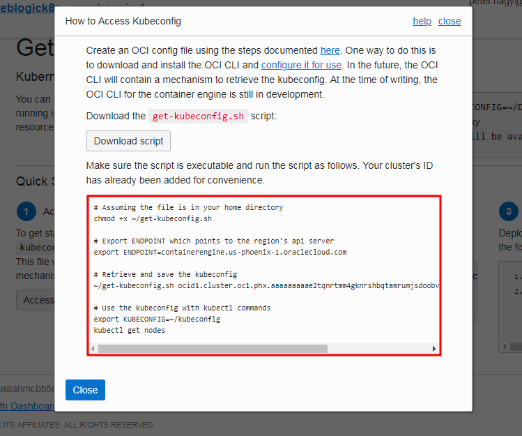

Modify if necessary then paste and execute commands.

	[oracle@localhost ~]$ # Assuming the file is in your home directory
	[oracle@localhost ~]$ chmod +x ~/get-kubeconfig.sh
	[oracle@localhost ~]$ 
	[oracle@localhost ~]$ # Export ENDPOINT which points to the region's api server
	[oracle@localhost ~]$ export ENDPOINT=containerengine.us-phoenix-1.oraclecloud.com
	[oracle@localhost ~]$ 
	[oracle@localhost ~]$ # Retrieve and save the kubeconfig
	[oracle@localhost ~]$ ~/get-kubeconfig.sh ocid1.cluster.oc1.phx.aaaaaaaaae2tqnrtmm4gumjsdoobvha3dgmtghc2tqzjtknrshbqttmm4amrmmyd > ~/kubeconfig
	[oracle@localhost ~]$  
	[oracle@localhost ~]$ # Use the kubeconfig with kubectl commands
	[oracle@localhost ~]$ export KUBECONFIG=~/kubeconfig
	[oracle@localhost ~]$ kubectl get nodes
	NAME              STATUS    ROLES     AGE       VERSION
	129.146.103.156   Ready     node      1d        v1.9.7
	129.146.133.192   Ready     node      1d        v1.9.7
	129.146.166.187   Ready     node      1d        v1.9.7

If you see the node's information the configuration was successful. Close the pop up window on your console.

Congratulation, now you have OCI - OKE environment ready to deploy your application.