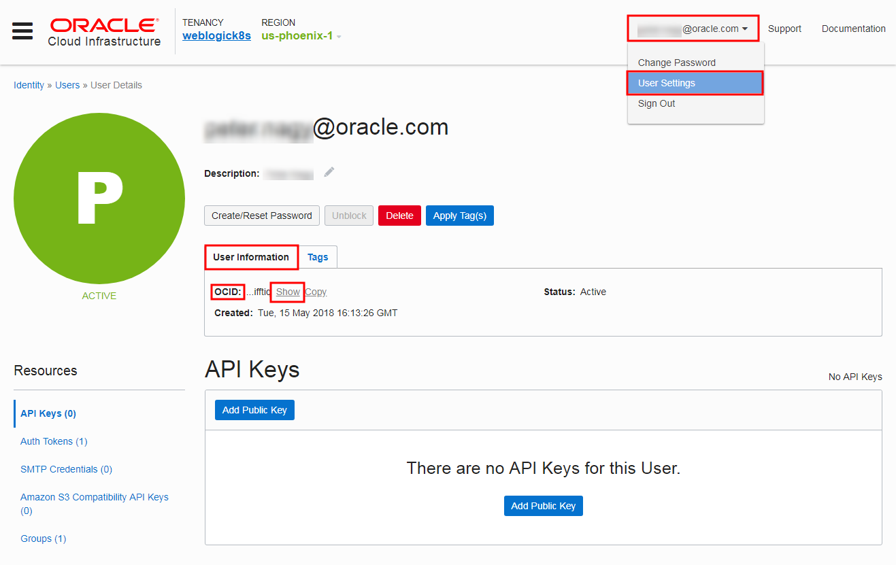
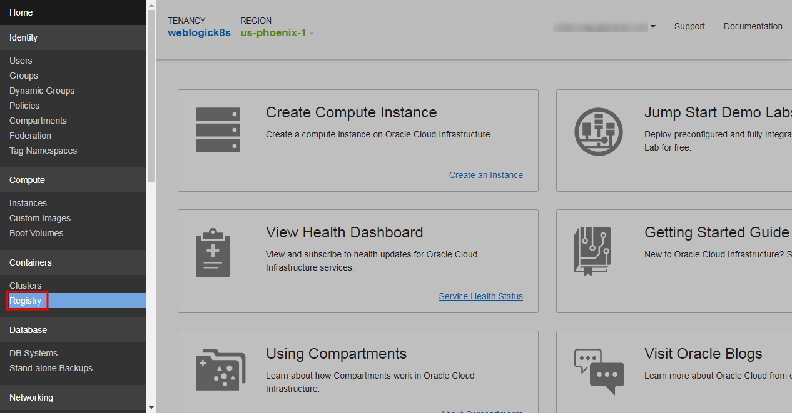
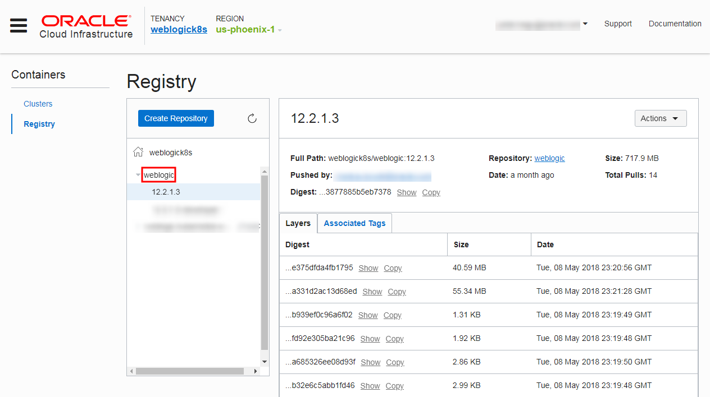
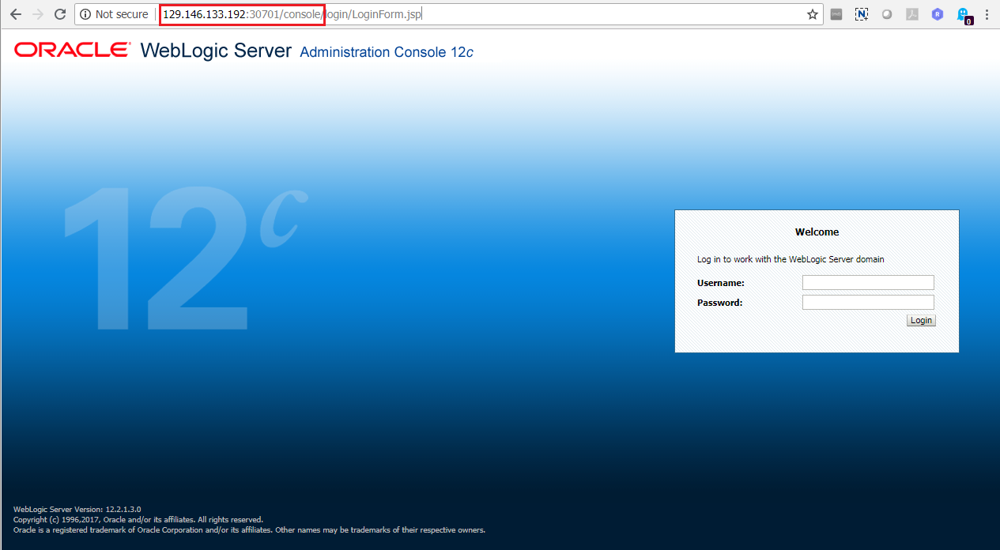
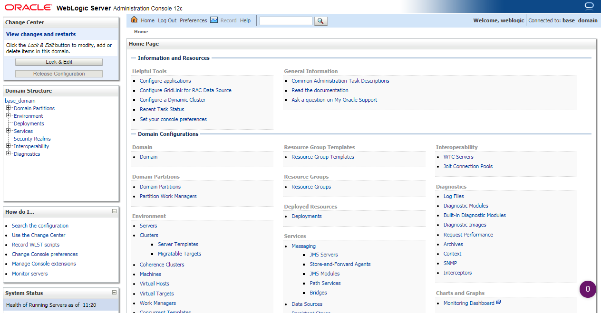

# Setup WebLogic Domain on Kubernetes #

Oracle provides WebLogic Kubernetes Operator to run WebLogic clusters in production or development mode and on Kubernetes clusters on-premises or in the cloud. The scope of this tutorial to show the steps to run a WebLogic cluster using the Oracle Cloud Infrastructure (OCI) Container Engine for Kubernetes (OKE).

This tutorial is based on the official [Oracle WebLogic Kubernetes Operator](https://github.com/oracle/weblogic-kubernetes-operator/blob/master/site/creating-domain.md) domain creation guide.

### Prerequisites ###

- [Oracle Cloud Infrastructure](https://cloud.oracle.com/en_US/cloud-infrastructure) enabled account.
- Running [Container Engine for Kubernetes (OKE)](setup.oke.md) cluster.
- [Oracle WebLogic Kubernetes Operator](create.weblogic.operator.md) image uploaded to Container Registry (OCIR).
- Desktop with `Docker 17.03.1.ce` and `kubectl` installed. `kubectl` has to be configured to access to the Kubernetes Cluster.

## Prepare the WebLogic Kubernetes Operator Environment 

#### Set up the RBAC policy for the OKE cluster ####

In order to have permission to access the Kubernetes cluster, you need to authorize your OCI account as a *cluster-admin* on the OCI Container Engine for Kubernetes cluster. This will require your OCID, which is available on the OCI console page, under your user settings. Click **Show** next to the OCID label and part of the value.

Then execute the role binding command:

	kubectl create clusterrolebinding my-cluster-admin-binding --clusterrole=cluster-admin --user=<YOUR_USER_OCID>

#### Set up the NFS server ####

The WebLogic domain must be installed into the folder that will be mounted as /shared/domain

At this time, the WebLogic on Kubernetes domain created by the WebLogic Server Kubernetes Operator, requires a shared file system to store the WebLogic domain configuration, which MUST be accessible from all the pods across the nodes. As a workaround, you need to configure an NFS server on one node and share the file system across all the nodes.

**Note**: Currently, we recommend that you use NFS version 3.0 for running WebLogic Server on OCI Container Engine for Kubernetes.

##### Retrieve node's public and private IP addresses #####

Enter the following `kubectl` command to get the public IP addresses of the nodes:

	$ kubectl get node 

The output of the command will display the nodes, similar to the following:

	NAME              STATUS    ROLES     AGE       VERSION
	129.146.103.156   Ready     node      9d        v1.9.7
	129.146.133.192   Ready     node      9d        v1.9.7
	129.146.166.187   Ready     node      9d        v1.9.7
 
To get private IP addresses you need to `ssh` into every node. This requires your private (RSA) key pair of the public key what you defined during OKE creation. Execute the following command for every node:

**ssh -i <YOUR\_RSA\_PRIVATE\_KEY\_LOCATION> opc@<PUBLIC\_IP\_OF\_NODE>**

For example:

	$ ssh -i ~/.ssh/id_rsa opc@129.146.103.156
	The authenticity of host '129.146.103.156 (129.146.103.156)' can't be established.
	ECDSA key fingerprint is SHA256:DjSi+nQJRgnuapgQp/zA9HisHzHjbev+jnjrBluAboo.
	ECDSA key fingerprint is MD5:8f:80:de:8b:0c:6e:29:c3:9c:bf:ee:6a:79:63:38:39.
	Are you sure you want to continue connecting (yes/no)? yes
	Warning: Permanently added '129.146.103.156' (ECDSA) to the list of known hosts.
	Oracle Linux Server 7.4
	Last login: Sat Jun 16 10:51:32 2018 from 86.59.134.172
	$

Retrieve private IP address executing this command:

	$ ip addr | grep ens3
	2: ens3: <BROADCAST,MULTICAST,UP,LOWER_UP> mtu 9000 qdisc mq state UP qlen 1000
    	inet 10.0.12.4/24 brd 10.0.12.255 scope global dynamic ens3

Find the inet value. For example the private address in the example above: 10.0.12.4

Repeat the query for each node. Note the IP addresses for easier usage:

| Nodes:             | Public IP       | Private IP |
|--------------------|-----------------|------------|
| Node1 - NFS Server | 129.146.103.156 | 10.0.12.4  |
| Node2              | 129.146.133.192 | 10.0.11.3  |
| Node3              | 129.146.166.187 | 10.0.10.3  |

###### Node1 - NFS server ######

Log in using `ssh` to **Node1**, and set up NFS Server:

	$ ssh -i ~/.ssh/id_rsa opc@129.146.103.156
	Oracle Linux Server 7.4
	Last login: Sat Jun 16 10:51:32 2018 from 86.59.134.172

Change to *root* user.

	[opc]$ sudo su -

Create `/scratch` shared directory.

	[root]$ mkdir /scratch

Modify `/etc/exports` to enable Node2, Node3 access to Node1 NFS server.

	[root]$ vi /etc/exports

---

**NOTE!** If the NFS is not installed on node then run `yum install -y nfs-utils` first as super user.

---

Add private IP addresses of Node2 and Node3.

	/scratch 10.0.11.3(rw)
	/scratch 10.0.10.3(rw)
	~                                                                                                                                                                               
	~                                                                                                                                                                               
	~                                                                                                                                                                               
	~                                                                                                                                                                               
	~                                                                                                                                                                               
	~                                                                                                                                                                               
	~                                                                                                                                                                               
	"/etc/exports" 2L, 46C

Save the changes and restart NFS service.

	[root]$ systemctl restart nfs

Exit as *root* and create the domain directory in the shared folder. Also change the access permissions of the folder.

	[root]$ exit
	[opc]$ mkdir -m 777 -p /scratch/external-domain-home/pv001
	[opc]$ chmod 777 -R /scratch/
	
Type **exit** to end the *ssh* session.

	[opc]$ exit

###### Node2 - NFS client ######

Log in using `ssh` to **Node2** and configure NFS client:

	$ ssh -i ~/.ssh/id_rsa opc@129.146.133.192
	Oracle Linux Server 7.4
	Last login: Sat Jun 16 10:51:32 2018 from 86.59.134.172

Change to *root* user.

	[opc]$ sudo su -

Create `/scratch` shared directory.

	[root]$ mkdir /scratch

Edit the `/etc/fstab` file.

	[root]$ vi /etc/fstab

Add the internal IP address and parameters of **Node1 - NFS server**. Append as last row.
	
	#
	# /etc/fstab
	# Created by anaconda on Fri Feb  9 01:25:44 2018
	#
	# Accessible filesystems, by reference, are maintained under '/dev/disk'
	# See man pages fstab(5), findfs(8), mount(8) and/or blkid(8) for more info
	#
	UUID=7247af6c-4b59-4934-a6be-a7929d296d83 /                       xfs     defaults,_netdev,_netdev 0 0
	UUID=897D-798C          /boot/efi               vfat    defaults,uid=0,gid=0,umask=0077,shortname=winnt,_netdev,_netdev,x-initrd.mount 0 0
	######################################
	## ORACLE BARE METAL CLOUD CUSTOMERS
	##
	## If you are adding an iSCSI remote block volume to this file you MUST
	## include the '_netdev' mount option or your instance will become
	## unavailable after the next reboot.
	##
	## Example:
	## /dev/sdb /data1  ext4    defaults,noatime,_netdev    0   2
	##
	## More information:
	## https://docs.us-phoenix-1.oraclecloud.com/Content/Block/Tasks/connectingtoavolume.htm
	##
	10.0.12.4:/scratch /scratch  nfs nfsvers=3 0 0
	~                                                                                                                                                                               
	~                                                                                                                                                                               
	~                                                                                                                                                                               
	~                                                                                                                                                                               
	~                                                                                                                                                                               
	~                                                                                                                                                                               
	~                                                                                                                                                                               
	~                                                                                                                                                                               
	"/etc/fstab" 24L, 957C

Save changes. Mount the shared `/scratch` directory.

	[root]$ mount /scratch

Exit as *root* and end the session.

	[root]$ exit
	[opc]$ exit

###### Node3 - NFS client ######

Log in using `ssh` to **Node3** and configure NFS client:

	$ ssh -i ~/.ssh/id_rsa opc@129.146.166.187
	Oracle Linux Server 7.4
	Last login: Sat Jun 16 10:51:32 2018 from 86.59.134.172

Change to *root* user.

	[opc]$ sudo su -

Create `/scratch` shared directory.

	[root]$ mkdir /scratch 

Edit the `/etc/fstab` file.

	[root]$ vi /etc/fstab

Add the internal IP address and parameters of **Node1 - NFS server**. Append as last row.
	
	#
	# /etc/fstab
	# Created by anaconda on Fri Feb  9 01:25:44 2018
	#
	# Accessible filesystems, by reference, are maintained under '/dev/disk'
	# See man pages fstab(5), findfs(8), mount(8) and/or blkid(8) for more info
	#
	UUID=7247af6c-4b59-4934-a6be-a7929d296d83 /                       xfs     defaults,_netdev,_netdev 0 0
	UUID=897D-798C          /boot/efi               vfat    defaults,uid=0,gid=0,umask=0077,shortname=winnt,_netdev,_netdev,x-initrd.mount 0 0
	######################################
	## ORACLE BARE METAL CLOUD CUSTOMERS
	##
	## If you are adding an iSCSI remote block volume to this file you MUST
	## include the '_netdev' mount option or your instance will become
	## unavailable after the next reboot.
	##
	## Example:
	## /dev/sdb /data1  ext4    defaults,noatime,_netdev    0   2
	##
	## More information:
	## https://docs.us-phoenix-1.oraclecloud.com/Content/Block/Tasks/connectingtoavolume.htm
	##
	10.0.12.4:/scratch /scratch  nfs nfsvers=3 0 0
	~                                                                                                                                                                               
	~                                                                                                                                                                               
	~                                                                                                                                                                               
	~                                                                                                                                                                               
	~                                                                                                                                                                               
	~                                                                                                                                                                               
	~                                                                                                                                                                               
	~                                                                                                                                                                               
	"/etc/fstab" 24L, 957C

Save changes. Mount the shared `/scratch` directory.

	[root]$ mount /scratch

Exit as *root* and end the session.

	[root]$ exit
	[opc]$ exit

#### Accept Licence Agreement to use `store/oracle/weblogic:12.2.1.3` image from Docker Store ####

If you have not used the base image [`store/oracle/weblogic:12.2.1.3`](https://store.docker.com/images/oracle-weblogic-server-12c) before, you will need to visit the [Docker Store web interface](https://store.docker.com/images/oracle-weblogic-server-12c) and accept the license agreement before the Docker Store will give you permission to pull that image.

Open [https://store.docker.com/images/oracle-weblogic-server-12c](https://store.docker.com/images/oracle-weblogic-server-12c) in a new browser and click **Log In**.

Enter your account details and click **Login**.

Click **Proceed to Checkout**.

Complete your contact information and accept agreements. Click **Get Content**.

Now you are ready to pull the  image on docker enabled host after authenticating yourself in Docker Hub using your Docker Hub credentials.

#### Upload the WebLogic Docker images to the OCI Registry ####

The process to move WebLogic image from Docker Store to your OCIR first pull the image to your desktop.

	$ docker pull store/oracle/weblogic:12.2.1.3
	12.2.1.3: Pulling from store/oracle/weblogic
	4040fe120662: Already exists 
	5788a5fddf0e: Already exists 
	88fc159ecf27: Already exists 
	138d86176392: Already exists 
	c8bbee357786: Pull complete 
	8bfb4a53e381: Pull complete 
	76a4c7bc88d8: Pull complete 
	Digest: sha256:e3e48963b360e6d7ce86659719487f568c89249979965210b48e979d7b262e1a
	Status: Downloaded newer image for store/oracle/weblogic:12.2.1.3
	[oracle@localhost ~]$ docker pull store/oracle/weblogic:12.2.1.3
	12.2.1.3: Pulling from store/oracle/weblogic
	Digest: sha256:e3e48963b360e6d7ce86659719487f568c89249979965210b48e979d7b262e1a
	Status: Image is up to date for store/oracle/weblogic:12.2.1.3
	$

Create tag (name) of the image which reflects the full container repository (OCIR) path including the registry where you want to push the image. In case of OCI it is the following format: `<region-code>.ocir.io/<tenancy-name>/<repos-name>/<image-name>:<tag>`.

- **<region-code>** is one of **fra** (Frankfurt), **iad** (Ashburn), **lhr** (London), or **phx** (Phoenix).
- **ocir.io** is the Oracle Cloud Infrastructure Registry name.
- **<tenancy-name>** is the name of the tenancy that owns the repository to which you want to push - the image.
- **<repo-name>** (if specified) is the name of a repository to which you want to push the image. You don't need to specify this now.
- **<image-name>** is the name you want to give the image in Oracle Cloud Infrastructure Registry. In this case recommended to leave *weblogic*.
- **<tag>** is an image tag you want to give the image in Oracle Cloud Infrastructure Registry. Use the same version number *12.2.1.3*.

Apply the new tag for WebLogic image as follow but don't forget to construct your image name.

**docker tag store/oracle/weblogic:12.2.1.3 <region-code>.ocir.io/<tenancy-name>/<image-name>:<tag>**

For example:

	$ docker tag store/oracle/weblogic:12.2.1.3 phx.ocir.io/weblogick8s/weblogic:12.2.1.3

Log in to Oracle Cloud Infrastructure Registry (OCIR) by entering `docker login <region-code>.ocir.io`, where:

| Region Code | Region Name |
|-------------|-------------|
| fra         | Frankfurt   |
| iad         | Ashburn     |
| lhr         | London      |
| phx         | Phoenix     |

For example:

	$ docker login phx.ocir.io
	Username: acme-dev/jdoe@acme.com
	Password: 
	Login Succeeded

When prompted, enter your username in the format `<tenancy_name>/<username>`. For example, **acme-dev/jdoe@acme.com**. When password is prompted, enter the auth token you generated and copied earlier.

Push the Docker image from the client machine to Oracle Cloud Infrastructure Registry by entering:

	$ docker push phx.ocir.io/weblogick8s/weblogic:12.2.1.3
	The push refers to repository [phx.ocir.io/weblogick8s/weblogic]
	4040fe120662: Pushed
	5788a5fddf0e: Pushed 
	88fc159ecf27: Pushed 
	138d86176392: Pushed 
	c8bbee357786: Pushed 
	8bfb4a53e381: Pushed 
	76a4c7bc88d8: Pushed
	12.2.1.3: digest: sha256:e40f7d4a8798eda625730d69392cc6c2b529027acd4cff0c93877885b5eb7378 size: 1991

Check the WebLogic Kubernetes Operator image in your OCIR repository. Open the OCI console click the menu icon  on the top-left corner and select **Registry** in the *Containers* section.

Select the `weblogic` repository and click the 12.2.1.3 *tag*.

#### Modify the operator and domain configuration YAML files ####

Final steps are to customize the parameters in the input YAML files for the WebLogic cluster and WebLogic Operator. The input YAML files and scripts provided in the [WebLogic Kubernetes Operator](https://github.com/oracle/weblogic-kubernetes-operator) project. 

Most likely you already cloned locally the WebLogic Kubernetes Operator source repository to build the operator image. If not then first clone locally. Using the following command the sources will be cloned into `weblogic-kubernetes-operator` folder in the current directory.

	git clone https://github.com/oracle/weblogic-kubernetes-operator.git
	Cloning into 'weblogic-kubernetes-operator'...
	remote: Counting objects: 17144, done.
	remote: Compressing objects: 100% (250/250), done.
	remote: Total 17144 (delta 149), reused 288 (delta 92), pack-reused 16757
	Receiving objects: 100% (17144/17144), 10.90 MiB | 1.99 MiB/s, done.
	Resolving deltas: 100% (10803/10803), done.

Change directory to `weblogic-kubernetes-operator/kubernetes` where the parameters input files located.

	cd weblogic-kubernetes-operator/kubernetes/internal

Modify the **image** field in the *create-weblogic-domain-job-template.yaml* file to the corresponding Docker repository image name in the OCIR. (line ~#278)

**image: <OCI\_REGION>.ocir.io/<YOUR\_OCI\_TENANCY>/weblogic:12.2.1.3**

For example:

	image: phx.ocir.io/weblogiconk8s/weblogic:12.2.1.3

Save and close *create-weblogic-domain-job-template.yaml* file. Open *domain-custom-resource-template.yaml* and modify here the WebLogic image registry location too. (line ~#24)

	image: <OCI_REGION>.ocir.io/<YOUR_OCI_TENANCY>/weblogic:12.2.1.3

Save and close *domain-custom-resource-template.yaml* file. Change directory one level up into `$SRC/weblogic-kubernetes-operator/kubernetes`

	cd ..

Open and modify the following parameters in the *create-weblogic-operator-inputs.yaml* input file:

| Parameter name                        | Value                                                                  | Note                                                                       |
|---------------------------------------|------------------------------------------------------------------------|----------------------------------------------------------------------------|
| targetNamespaces                      | domain1                                                                |                                                                            |
| weblogicOperatorImage                 | <ocir_region>.ocir.io/<oci_tenancy>/weblogic-kubernetes-operator:<tag> | For example: phx.ocir.io/weblogick8s/weblogic-kubernetes-operator:pnagy0.2 |
| weblogicOperatorImagePullSecretName   | OCIRSecret                                                             | Don't forget to remove comment character '#' if necessary                  |
| externalRestOption                    | SELF_SIGNED_CERT                                                       |                                                                            |
| externalSans                          | IP:129.146.103.156                                                     | Node1 - NFS server public IP address                                       |

Save the changes. Open and modify the following parameters in the *create-weblogic-domain-inputs.yaml* input file:

| Parameter name            | Value                               | Note |
|---------------------------|-------------------------------------|------|
| domainUID                 | domain1                             |      |
| weblogicDomainStoragePath | /scratch/external-domain-home/pv001 |      |
| t3PublicAddress           | 0.0.0.0                             |      |
| exposeAdminT3Channel      | true                                |      |
| exposeAdminNodePort       | true                                |      |
| namespace                 | domain1                             |      |
|loadBalancer               | TRAEFIK                             |      |

Save the changes.

#### Deploy WebLogic Kubernetes Operator and WebLogic Domain ####

You are almost there, but before execute the provided scripts you need create necessary Kubernetes resources required by the operator and domain.

This demo operator is configured to be run in the namespace *weblogic-operator*. To create namespace *weblogic-operator*, execute this command:

	kubectl create namespace weblogic-operator

Create a Docker registry secret for the operator to enable access to the `weblogic-kubernetes-operator` and `weblogic` images in the OCIR repository where you uploaded:

**kubectl -n weblogic-operator create secret docker-registry <secret_name> --docker-server=<region>.ocir.io --docker-username=<oci\_tenancyname>/<oci\_username> --docker-password=<ocir\_auth\_token> --docker-email=example_email**

For example:

	kubectl -n weblogic-operator create secret docker-registry OCIRSecret --docker-server=phx.ocir.io --docker-username=acme-dev/jdoe@acme.com --docker-password=k]j64r{1<sJSSF-;>)K8 --docker-email=jdoe@acme.com

This demo domain is configured to be run in the namespace *domain1*. To create namespace *domain1*, execute this command:

	kubectl create namespace domain1

The username and password credentials for access to the Administration Server must be stored in a Kubernetes secret in the same namespace that the domain will run in. The script does not create the secret in order to avoid storing the credentials in a file. To create the secret for this demo, issue the following command:

	kubectl -n domain1 create secret generic domain1-weblogic-credentials username=weblogic password=<PASSWORD>

Create output directory for the operator and domain scripts.
	
	mkdir -p /PATH_TO/weblogic-operator-output-directory
	mkdir -p /PATH_TO/weblogic-domain-output-directory

Finally, run the create operator script first, pointing it at your inputs file and the output directory. The best to execute in the locally cloned `weblogic-kubernetes-operator/kubernetes` folder:

	./create-weblogic-operator.sh -i create-weblogic-operator-job-inputs.yaml -o /PATH_TO/weblogic-operator-output-directory
	Input parameters being used
	export version="create-weblogic-operator-inputs-v1"
	export serviceAccount="weblogic-operator"
	export namespace="weblogic-operator"
	export targetNamespaces="domain1"
	export weblogicOperatorImage="peternagy/weblogic-kubernetes-operator:e77427ed82d2d3a1cb5a21e0e56720e2d24076c3"
	export weblogicOperatorImagePullPolicy="IfNotPresent"
	export weblogicOperatorImagePullSecretName="dockersecret"
	export externalRestOption="SELF_SIGNED_CERT"
	export externalRestHttpsPort="31001"
	export externalSans="IP:129.146.120.224"
	export remoteDebugNodePortEnabled="false"
	export internalDebugHttpPort="30999"
	export externalDebugHttpPort="30999"
	export javaLoggingLevel="FINER"
	export elkIntegrationEnabled="false"
	
	The WebLogic operator REST interface is externally exposed using a generated self-signed certificate that contains the customer-provided list of subject alternative names.
	Checking to see if the secret dockersecret exists in namespace weblogic-operator
	/u01/content/weblogic-kubernetes-operator/kubernetes/internal
	Generating a self-signed certificate for the operator's internal https port with the subject alternative names DNS:internal-weblogic-operator-svc,DNS:internal-weblogic-operator-svc.weblogic-operator,DNS:internal-weblogic-operator-svc.weblogic-operator.svc,DNS:internal-weblogic-operator-svc.weblogic-operator.svc.cluster.local
	Generating a self-signed certificate for the operator's external ssl port with the subject alternative names IP:129.146.120.224
	Generating /u01/content/weblogic-operator-output-directory/weblogic-operators/weblogic-operator/weblogic-operator.yaml
	Running the weblogic operator security customization script
	...
	Generating YAML script /u01/content/weblogic-operator-output-directory/weblogic-operators/weblogic-operator/weblogic-operator-security.yaml to create WebLogic Operator security configuration...
	Create the WebLogic Operator Security configuration using kubectl as follows: kubectl create -f /u01/content/weblogic-operator-output-directory/weblogic-operators/weblogic-operator/weblogic-operator-security.yaml
	Ensure you start the API server with the --authorization-mode=RBAC option.
	Checking to see if the namespace weblogic-operator already exists
	The namespace weblogic-operator already exists
	Checking the target namespace domain1
	Checking to see if the namespace domain1 already exists
	The namespace domain1 already exists
	Checking to see if the service account weblogic-operator already exists
	The service account weblogic-operator already exists
	Applying the generated file /u01/content/weblogic-operator-output-directory/weblogic-operators/weblogic-operator/weblogic-operator-security.yaml
	namespace "weblogic-operator" configured
	serviceaccount "weblogic-operator" unchanged
	clusterrole "weblogic-operator-cluster-role" configured
	clusterrole "weblogic-operator-cluster-role-nonresource" configured
	clusterrolebinding "weblogic-operator-operator-rolebinding" configured
	clusterrolebinding "weblogic-operator-operator-rolebinding-nonresource" configured
	clusterrolebinding "weblogic-operator-operator-rolebinding-discovery" configured
	clusterrolebinding "weblogic-operator-operator-rolebinding-auth-delegator" configured
	clusterrole "weblogic-operator-namespace-role" configured
	rolebinding "weblogic-operator-rolebinding" configured
	Checking the cluster role weblogic-operator-namespace-role was created
	Checking role binding weblogic-operator-rolebinding was created for each target namespace
	Checking role binding weblogic-operator-rolebinding for namespace domain1
	Checking the cluster role weblogic-operator-cluster-role was created
	Checking the cluster role bindings weblogic-operator-operator-rolebinding were created
	Applying the file /u01/content/weblogic-operator-output-directory/weblogic-operators/weblogic-operator/weblogic-operator.yaml
	configmap "weblogic-operator-cm" configured
	secret "weblogic-operator-secrets" configured
	deployment "weblogic-operator" configured
	service "external-weblogic-operator-svc" unchanged
	service "internal-weblogic-operator-svc" unchanged
	Waiting for operator deployment to be ready...
	status is 1, iteration 1 of 10
	Checking the operator labels
	Checking the operator pods
	Checking the operator Pod status
	
	The Oracle WebLogic Server Kubernetes Operator is deployed, the following namespaces are being managed: domain1
	
	The following files were generated:
	  /u01/content/weblogic-operator-output-directory/weblogic-operators/weblogic-operator/create-weblogic-operator-inputs.yaml
	  /u01/content/weblogic-operator-output-directory/weblogic-operators/weblogic-operator/weblogic-operator.yaml
	  /u01/content/weblogic-operator-output-directory/weblogic-operators/weblogic-operator/weblogic-operator-security.yaml
	
	Completed

Check the pod status in *weblogic-operator* namespace:

	kubectl get pod -n weblogic-operator 
	NAME                                 READY     STATUS    RESTARTS   AGE
	weblogic-operator-58d944d448-jxbph   1/1       Running   0          1m

The operator is running then execute the similar command for the WebLogic domain creation:

	./create-weblogic-domain.sh -i create-weblogic-domain-inputs.yaml  -o /u01/content/weblogic-domain-output-directory
	Input parameters being used
	export version="create-weblogic-domain-inputs-v1"
	export adminPort="7001"
	export adminServerName="admin-server"
	export domainName="base_domain"
	export domainUID="domain1"
	export clusterType="DYNAMIC"
	export startupControl="AUTO"
	export clusterName="cluster-1"
	export configuredManagedServerCount="2"
	export initialManagedServerReplicas="2"
	export managedServerNameBase="managed-server"
	export managedServerPort="8001"
	export weblogicDomainStorageType="HOST_PATH"
	export weblogicDomainStoragePath="/scratch/external-domain-home/pv001"
	export weblogicDomainStorageReclaimPolicy="Retain"
	export weblogicDomainStorageSize="10Gi"
	export productionModeEnabled="true"
	export weblogicCredentialsSecretName="domain1-weblogic-credentials"
	export t3ChannelPort="30012"
	export t3PublicAddress="kubernetes"
	export exposeAdminT3Channel="false"
	export adminNodePort="30701"
	export exposeAdminNodePort="false"
	export namespace="domain1"
	export loadBalancer="TRAEFIK"
	export loadBalancerAppPrepath="/"
	export loadBalancerWebPort="30305"
	export loadBalancerDashboardPort="30315"
	export javaOptions="-Dweblogic.StdoutDebugEnabled=false"
	
	Generating /u01/content/weblogic-domain-output-directory/weblogic-domains/domain1/weblogic-domain-pv.yaml
	Generating /u01/content/weblogic-domain-output-directory/weblogic-domains/domain1/weblogic-domain-pvc.yaml
	Generating /u01/content/weblogic-domain-output-directory/weblogic-domains/domain1/create-weblogic-domain-job.yaml
	Generating /u01/content/weblogic-domain-output-directory/weblogic-domains/domain1/domain-custom-resource.yaml
	Generating /u01/content/weblogic-domain-output-directory/weblogic-domains/domain1/weblogic-domain-traefik-cluster-1.yaml
	Generating /u01/content/weblogic-domain-output-directory/weblogic-domains/domain1/weblogic-domain-traefik-security-cluster-1.yaml
	Checking to see if the secret domain1-weblogic-credentials exists in namespace domain1
	Checking if the persistent volume domain1-weblogic-domain-pv exists
	No resources found.
	The persistent volume domain1-weblogic-domain-pv does not exist
	Creating the persistent volume domain1-weblogic-domain-pv
	persistentvolume "domain1-weblogic-domain-pv" created
	Checking if the persistent volume domain1-weblogic-domain-pv is Available
	Checking if the persistent volume claim domain1-weblogic-domain-pvc in namespace domain1 exists
	No resources found.
	The persistent volume claim domain1-weblogic-domain-pvc does not exist in namespace domain1
	Creating the persistent volume claim domain1-weblogic-domain-pvc
	persistentvolumeclaim "domain1-weblogic-domain-pvc" created
	Checking if the persistent volume domain1-weblogic-domain-pv is Bound
	Checking if object type job with name domain1-create-weblogic-domain-job exists
	No resources found.
	Creating the domain by creating the job /u01/content/weblogic-domain-output-directory/weblogic-domains/domain1/create-weblogic-domain-job.yaml
	configmap "domain1-create-weblogic-domain-job-cm" created
	job "domain1-create-weblogic-domain-job" created
	Waiting for the job to complete...
	status on iteration 1 of 20
	pod domain1-create-weblogic-domain-job-jjssn status is ContainerCreating
	Error from server (BadRequest): container "create-weblogic-domain-job" in pod "domain1-create-weblogic-domain-job-jjssn" is waiting to start: ContainerCreating
	status on iteration 2 of 20
	pod domain1-create-weblogic-domain-job-jjssn status is Running
	status on iteration 3 of 20
	pod domain1-create-weblogic-domain-job-jjssn status is Completed
	Setting up traefik security
	clusterrole "domain1-cluster-1-traefik" created
	clusterrolebinding "domain1-cluster-1-traefik" created
	Checking the cluster role domain1-cluster-1-traefik was created
	Checking the cluster role binding domain1-cluster-1-traefik was created
	Deploying traefik
	serviceaccount "domain1-cluster-1-traefik" created
	deployment "domain1-cluster-1-traefik" created
	configmap "domain1-cluster-1-traefik-cm" created
	service "domain1-cluster-1-traefik" created
	service "domain1-cluster-1-traefik-dashboard" created
	Checking traefik deployment
	Checking the traefik service account
	Checking traefik service
	Creating the domain custom resource using /u01/content/weblogic-domain-output-directory/weblogic-domains/domain1/domain-custom-resource.yaml
	domain "domain1" created
	Checking the domain custom resource was created
	
	Domain base_domain was created and will be started by the WebLogic Kubernetes Operator
	
	The load balancer for cluster 'cluster-1' is available at http://c2tqzjtmmyd.us-phoenix-1.clusters.oci.oraclecloud.com:30305/ (add the application path to the URL)
	The load balancer dashboard for cluster 'cluster-1' is available at http://c2tqzjtmmyd.us-phoenix-1.clusters.oci.oraclecloud.com:30315
	
	The following files were generated:
	  /u01/content/weblogic-domain-output-directory/weblogic-domains/domain1/create-weblogic-domain-inputs.yaml
	  /u01/content/weblogic-domain-output-directory/weblogic-domains/domain1/weblogic-domain-pv.yaml
	  /u01/content/weblogic-domain-output-directory/weblogic-domains/domain1/weblogic-domain-pvc.yaml
	  /u01/content/weblogic-domain-output-directory/weblogic-domains/domain1/create-weblogic-domain-job.yaml
	  /u01/content/weblogic-domain-output-directory/weblogic-domains/domain1/domain-custom-resource.yaml
	  /u01/content/weblogic-domain-output-directory/weblogic-domains/domain1/weblogic-domain-traefik-security-cluster-1.yaml
	  /u01/content/weblogic-domain-output-directory/weblogic-domains/domain1/weblogic-domain-traefik-cluster-1.yaml
	
	Completed

To check the status of the WebLogic cluster, run this command:

	kubectl get pod -n domain1 
	NAME                                         READY     STATUS    RESTARTS   AGE
	domain1-admin-server                         1/1       Running   0          9m
	domain1-cluster-1-traefik-778bc994f7-7mjw6   1/1       Running   0          9m
	domain1-managed-server1                      1/1       Running   0          7m
	domain1-managed-server2                      1/1       Running   0          7m

You have to see four running pods similar to the result above.

Because the WebLogic cluster is exposed to the external world using the external IP addresses of the nodes you can use any of the node’s public IP addresses to access the Administration Console. The Administration console port is configured in *create-weblogic-domain-inputs.yaml* and by default 30701. To check run the following command which shows detailed information including NodePort configuration of the admin server pod:

	kubectl describe service -n domain1 domain1-admin-server
	Name:                     domain1-admin-server
	Namespace:                domain1
	Labels:                   weblogic.createdByOperator=true
	                          weblogic.domainName=base_domain
	                          weblogic.domainUID=domain1
	                          weblogic.resourceVersion=domain-v1
	                          weblogic.serverName=admin-server
	Annotations:              service.alpha.kubernetes.io/tolerate-unready-endpoints=true
	Selector:                 weblogic.createdByOperator=true,weblogic.domainUID=domain1,weblogic.serverName=admin-server
	Type:                     NodePort
	IP:                       10.96.219.0
	Port:                     <unset>  7001/TCP
	TargetPort:               7001/TCP
	NodePort:                 <unset>  30701/TCP
	Endpoints:                10.244.3.5:7001
	Session Affinity:         None
	External Traffic Policy:  Cluster
	Events:                   <none>

Find the NodePort parameter. It should be the default 30701.

Use one of the node's public IP address and construct the Administration Console url:

**http://<NODE\_X\_IP\_PUBLIC\_ADDRESS>:30701/console**

Enter the credentials defined in the secret *domain1-weblogic-credentials* previously. Click login.

Congratulations! You have successfully deployed WebLogic domain on (OKE) Kubernetes cluster.